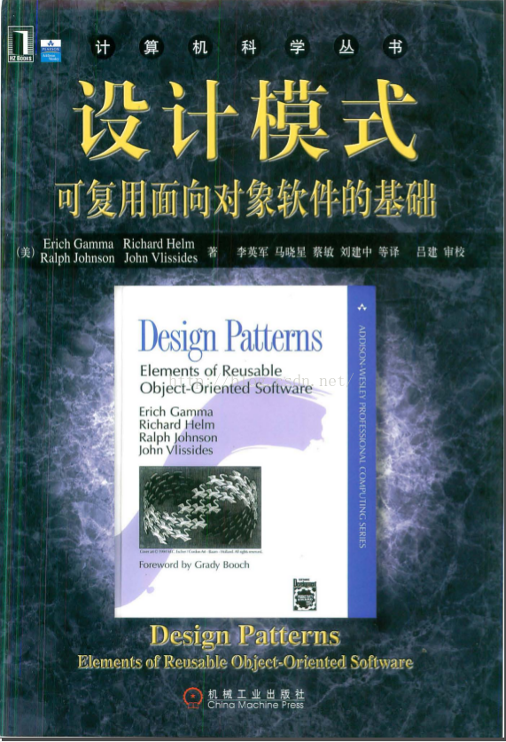

# Head First Design Parttern

中文：Head First 设计模式  
作者：O'Reilly

- 设计即生活。  
  思考：设计 即显化需求
- 设计模式的经典书籍：  
   《Design Patterns: Elements of Reusable Object-Oriented Software》(设计模式：可复用面向对象软件的基础），经典但难懂。作者是`四人组（Gang of Four，GoF）：Gamma, Johnson, Helm, Vlissides`。  
  

  《设计模式之禅》  
   http://yuedu.baidu.com/ebook/d7260e63844769eae109ed60?fr=aladdin&key=

- 《Head First 设计模式》，可以看作是《Design Patterns》的注释版/ 白话版/漫画版/搞笑版，涵盖了 24 个设计模式。  
  特点：易懂、简单、有趣。  
  可以作为设计模式的入门。
- 设计模式适合任何 OO 语言
- 采用“类” UML 图，而非 UML 类图。
- 没有包含所有的设计模式  
  设计模式有很多：Gof 的基础模式、Sun 的 J2EE 模式、JSP 模式、架构模式、游戏设计模式  
  书中焦点是 Gof 的重要模式，Gof 的其他模式在附录中概略介绍
- 书中“组合（Composition）”，指 OO 一般概念中的组合 Composition，不是 UML 严格定义的 Composition
- Book Code  
  https://www.wickedlysmart.com/head-first-design-patterns/

- 设计模式是针对一些特定场景的、比较通用的解决方案。
- 学习设计模式  
  使用场景、方案（即用途：它解决了什么问题）、优点、缺点、与相似的模式之间的区别
- 使用设计模式  
  最好的方式：“把设计模式装进脑袋里，然后在设计和已有的应用中使用，寻找何处可以使用它们。”以往是代码复用，现在是经验复用。  
  优先考虑使用场景以及要解决的问题，其次考虑各种解决方案之间的优劣对比，最后——其实压根也不用去考虑——到底要使用模式 A 还是模式 B。
- [与设计模式相处 —— 真实世界中的模式](与设计模式相处.md)

# 设计工具箱中内的工具

## OO 基础

抽象  
封装  
多态  
继承

## [OO 原则（设计原则）（10）](设计原则.md)

| 原则                                                                                                     | 描述                             |
| -------------------------------------------------------------------------------------------------------- | -------------------------------- |
| [原则 1：封装变化](策略模式.md#design_principles_1)                                                      | -                                |
| [原则 2：多用组合，少用继承](策略模式.md#design_principles_2)                                            | -                                |
| [原则 3：针对接口编程，而不是针对实现编程](策略模式.md#design_principles_3)                              | -                                |
| [原则 4：松耦合](观察者模式.md#design_principles_4)                                                      | 为交互对象之间的松耦合设计而努力 |
| [原则 5: 开放-关闭原则 (Open Close Principle)](装饰者模式.md#Open_Close_Principle)                       | 类应该对扩展开放，对修改关闭     |
| [原则 6: 依赖倒置原则 (Depency Inverse Principle)](工厂模式.md#Depency_Inverse_Principle)                | 依赖抽象，不依赖具体类           |
| [原则 7: 最少知识原则 (（Least Knowledge Principle)：](外观模式.md#（Least_Knowledge_Principle)          | 只和朋友谈                       |
| [原则 8: 好莱坞原则 (Hollywood Principle)：别找我，我会找你](模版方法模式.md#Hollywood_Principle)        | 别找我，我会找你                 |
| [原则 9: 单一责任原则 (Single Responsibility Principle) ](迭代器模式.md#Single_Responsibility_Principle) | 类应该只有一个改变的理由         |

## OO 模式（设计模式）(16)

| 模式                                                     | 描述                                                                                       |                      |
| -------------------------------------------------------- | ------------------------------------------------------------------------------------------ | -------------------- |
| [策略模式(Strategy Pattern)](策略模式.md)                | 封装可互换的行为，然后使用委托（对象组合）来决定采用哪一个行为                             | 封装算法             |
| [观察者模式(Observer Pattern)](观察者模式.md)            | 当某个状态改变时，允许一群对象能被通知到                                                   | 让对象知悉现状       |
| [装设者模式（Decorator Pattern）](装饰者模式.md)         | -                                                                                          | 包装对象，以装饰对象 |
| [工厂模式（Factory Pattern)](工厂模式.md)                | 工厂方法：由子类决定实例化哪个具体类                                                       | 封装对象创建         |
| [单件模式 (Singleton Pattern)](单例模式.md)              | -                                                                                          | -                    |
| [命令模式(Command Pattern)](命令模式.md#Command_Pattern) | -                                                                                          | 封装调用             |
| [空对象(NULL Object)](命令模式.md#NULL_Object)           | -                                                                                          | -                    |
| [适配器模式 (Adapter Pattern）](适配器模式.md)           | 改变一个或多个类的接口                                                                     | 包装对象，以转换接口 |
| [外观模式( Facade Pattern)](外观模式.md)                 | 简化一群类的接口                                                                           | 包装对象，以简化接口 |
| [单件模式 (Singleton Pattern)](单例模式.md)              | -                                                                                          | -                    |
| [模版方法模式(Template Method Pattern)](模版方法模式.md) | 由子类决定如何实现算法中的步骤                                                             | 封装算法             |
| [迭代器模式)](迭代器模式.md)                             | 提供一个方式来遍历集合，而无需暴露集合的实现                                               | 管理集合             |  |
| [组合模式(Composite Pattern)](组合模式.md)               | 客户可以将对象的集合以及个别的对象一视同仁                                                 | 管理集合             |  |
| [状态模式(State Pattern)](状态模式.md)                   | 封装基于状态的行为，并将行为委托到当前状态：通过改变对象内部的状态来实现对象控制自己的行为 | 事物的状态           |
| [代理模式 (Proxy Pattern)](代理模式.md)                  | 包装另一个对象，并控制它的访问                                                             | 控制对象访问         |
| [复合模式 (Compound Pattern)](复合模式.md)               | -                                                                                          | 模式中的模式         |

- [工厂模式（Factory Pattern)](工厂模式.md)  
  [简单工厂(Simple Factory)](工厂模式.md#Simple_Factory) ：不是模式  
  [工厂方法模式(Factory Method Pattern)](工厂模式.md#Factory_Method_Pattern)  
  [抽象工厂模式(Abstact Factory Pattern)](工厂模式.md#Abstact_Factory_Pattern)
- [适配器模式 (Adapter Pattern）](适配器模式.md)  
  类适配器模式  
  对象适配器模式
- [模版方法模式(Template Method Pattern)](模版方法模式.md)  
  钩子
- 代理模式
  | 代理模式 (9) |
  | ------------------------------------- |
  | 远程代理(Remote Proxy) |
  | 虚拟代理(Virtual Proxy) |
  | 保护代理(Protection Proxy) |
  | 防火墙代理(Firewall Proxy) |
  | 智能引用代理(Smart Reference Proxy) |
  | 缓存代理（Caching Proxy） |
  | 同步代理(Synchronization Proxy) |
  | 复杂隐藏代理(Complexity Hiding Proxy) | |
  | 写入时复制代理(Copy-On-Write Proxy) |

- 复合模式  
  MVC

## VS

| 模式   | 描述                             |
| ------ | -------------------------------- |
| 装饰者 | 包装另一个对象，并提供额外的行为 |
| 外观   | 包装许多对象，以简化它们的接口   |
| 代理   | 包装另一个对象，并控制对象访问   |
| 适配器 | 包装另一个对象，并提供不同接口   |

# Refs

- [Design Patterns](https://sourcemaking.com/design_patterns)
- https://refactoring.guru/design-patterns/java
- https://www.journaldev.com/java/design-patterns
- https://blog.csdn.net/annaload/article/details/51172013
- http://c.biancheng.net/design_pattern/
- https://blog.csdn.net/sinat_36053757/article/details/71018156
