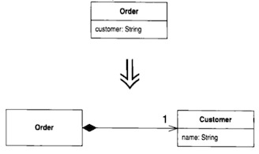

# 第 8 章 重新组织你的数据

## 8.1 Self Encapsulate Field（自封装值域）

When ：当直接访问一个字段时，但与字段之间的耦合关系逐渐变得笨拙 ：当这个字段权限更改，或者名称更改之后你的客户端代码都需要做相应的改变。  
How ： 这个字段建立设值和取值函数并且只以这些函数来访问字段

- 在这个类中，直接访问还是间接访问字段？  
  用“字段直接访问”：  
   自由灵活访问；  
   代码比较容易阅读。

  用“访问函数间接访问”：  
   通过覆写一个函数从而改变获取数据的方式：因为规则改变了；  
   支持更灵活的数据管理方式，例如延迟初始化。

  延迟初始化：只有在真正使用某值时，才对它初始化。

  如何选择？  
   先使用直接访问方式。直到这种方式带来麻烦，用重构变成间接使用方式。

- 在构造函数中不推荐使用设置函数。  
  设置函数被认为应该在对象创建后才使用。  
  Way 1 ：在构造函数中直接访问字段  
  Way 2 ：单独另建一个初始化函数

## 8.2 Replace Data Value with Object（以对象取代数据值）

When ： 有一个数据项，需要与其他数据和行为一起使用才有意义。  
e.g.,
电话号码 - 区号  
订单 - 客户信息（地址，名称、手机号等）

How : 将数据项变成对象。  
可能需要对 新类使用 Change Value to Reference（179）

- 值对象 vs 引用对象 ?  
  值对象(Value Object)：不可修改内容。  
  引用对象(Reference Object)：同一个客户的所有 Order 对象可以共享同一个 Customer 对象。

## 8.3 Change Value to Reference（将实值对象改为引用对象）

## 8.4 Change Reference to Value（将引用对象改为实值对象）

## 8.5 Replace Array with Object（以对象取代数组）

## 8.6 Duplicate Observed Data（复制「被监视数据」）

## 8.7 Change Unidirectional Association to Bidirectional（将单向关联改为## 双向）

## 8.8 Change Bidirectional Association to Unidirectional（将双向关联改为## 单向）

## 8.9 Replace Magic Number with Symbolic Co tant （以符号常量/字面常量 取代魔## 法数）

## 8.10 Encapsulate Field（封装值域）

## 8.11 Encapsulate Collection（封装群集）

## 8.12 Replace Record with Data Class（以数据类取代记录）

## 8.13 Replace Type Code with Class（以类取代型别码）

## 8.14 Replace Type Code with Subclasses （以子类取代型别码）

## 8.15 Replace Type Code with State/Strategy （以 State/Strategy 取代型别码）

## 8.16 Replace Subclass with Fields（以值域取代子类）
