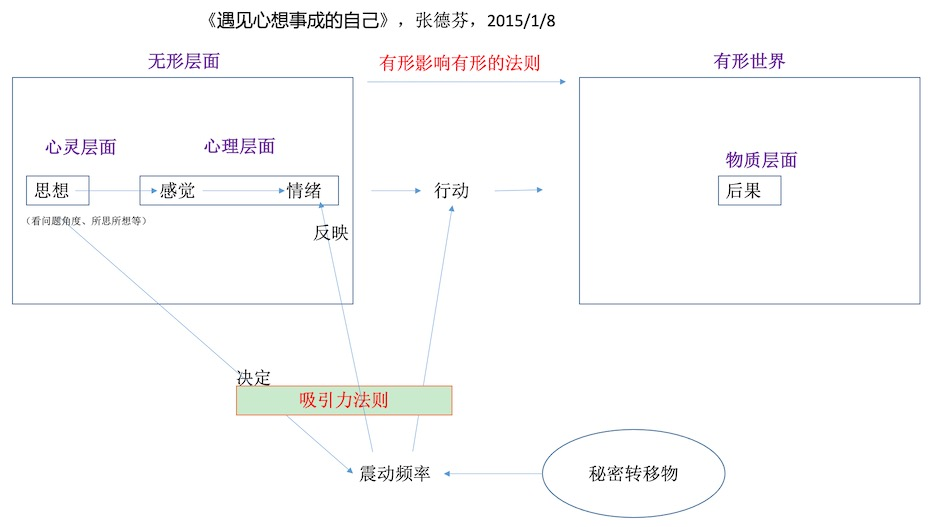

#《遇见心想事成的自己》，张德芬，2015/1/8

1 (1)无形影响有行的法则 （2）吸引力法则  
2 思想、情绪都有震动频率。正面的思想或者情绪有较高的频率，反之亦然。  
3 心想事成的步骤：  
（1）发愿阶段  
找出真心想要的东西，最终状态，限制性人生模式或信念，并发愿。  
（2）感恩阶段  
怀着感恩的心去做（虚位以待，帮助别人）  
（3）接受阶段  
接受等待，学会放下。  
4 思想决定情绪。情绪反应思想。
