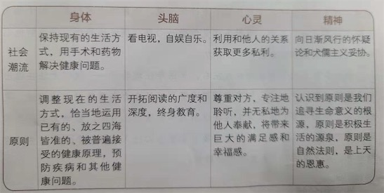

# 前言

- 变化越彻底，挑战越严峻，这个七个习惯对人们越来越重要。因为问题和痛苦是普遍存在的，并且日趋严峻。而它们的解决之道，一直而永远都建立在普遍、永恒、不证自明的原则之上。
- 对生命的感悟：发掘并应用一些原则或自然法则，完成最渴望的目标，战胜最艰巨的挑战。如何应用一个原则，因而而异，取决于个人独一无二的天赋和创造力。成功离不开灵活运用某些原则。

# 人类面临的最普遍的几种挑战

## 1 恐惧和不安全感

挑战：现代大多人饱受恐惧感的折磨。恐怖将来、恐惧失业、 恐惧无力养家。这种弱点造成一种倾向：倾向于零风险的生活，并逃避于他人互相依赖和合作。  
原因：无法掌控现在和未来，社会变化太快  
措施：独立，同时又互相依赖、彼此合作

## 2 我现在就想得到

挑战：想要太多，太急  
原因：购买力不足，远远小于不断发展的产能。仅仅努力工作远远不够

措施：  
平衡：  
今天的需要：每日有产出  
将来的需要：投资并提高将来竞争力，以取得将来的持久成功

平衡原则同样适合于：健康、婚姻、家庭生活、以及所在的社区。

## 3 谴责和抱怨

挑战：  
面对问题和挑战，习惯性地谴责其他人和事。这样只能带来暂时的解脱，反而把自己禁锢在问题中，找不到问题的解决方法

原因：  
推卸责任，以询的短暂的解脱  
错误地认为自己是环境的牺牲品

措施：  
谦逊：任何人都会犯错  
接受并承担责任  
带勇气去创造性的想法去战胜或避开困难

## 4 绝望无助

挑战：孤独无援

原因:  
谴责周围人和事的结果造成绝望无助。  
错误地认为自己是环境的牺牲品  
丢弃希望，听天由命，让外在主导自己

措施:  
怀抱希望、励志成长。“我就是生命的创造力”

## 5 缺乏人生平衡

挑战：对人要求更为苟刻，让人感觉更加紧迫、心力交瘁。

原因：  
陷在一些鸡毛蒜皮的小事上而不能自拔，而把健康、家庭、品德以及许多重要的事情。  
不能把问题归咎于工作，或社会的复杂和变迁，问题在于流行文化提倡“早来、晚走、多出成果，为现在牺牲一切”。而心灵的平和宁静不是这些技巧所能实现的。

措施：  
明白什么是最重要的事情，并专注、正直地对待这些事情，那么将迎来幸福和安宁。

## 6 ”我的定位在哪儿？”

挑战：认为资源有限，别人被看作成竞争对手，自己一定要赢。
措施：团队精神、合作精神

## 7 渴望理解

挑战：  
渴望理解：希望别人聆听、尊重或重视自己的声音，希望能够影响别人。  
大部分认为，影响力：当对方感觉你敞开心扉，虔诚地聆听，并理解他们的时候，他们就感觉自己有了影响力。

原因：  
当别人在诉说时，你没有在聆听并尝试理解对方，而是常常忙着思考自己接下来应该怎么说？

措施：  
影响力是以互相理解为前提，互相理解的前题是需要谈话者全心投入地做一个专注、主动的聆听者，至少谈话一方要首先学会聆听。

如何聆听？  
情绪不要受对方影响，专心聆听。在说出自己的想法前，先把事情搁置一旁，倾尽全力来理解对方的想法。

## 8 冲突分歧

挑战：  
分歧（动机、目标、思维方式、价值观）带来冲突

原因：  
面对分歧和冲突，采用竞争来解决，“全力以赴、赢得胜利”。虽然可能采用“折中”，但是这些分歧导致人们只接受共识，拒绝无法认可的部分，进而产生阻碍。最后得到的并不是最优解。

措施：  
充分利用创造性合作，找到最好的解决办法。

## 9 人生停滞不前

人的本质是思维的 —— 身体、头脑、心灵、精神。  

心理学家 亚伯拉罕.马斯洛，把`自我超越`放置于`自我实现`之上。  
`自我超越`：幸福感、成就感、对后人的福祉。  
`自我实现`：`需求层次理论`的最高级别。
