# Update Android SDK

# 1 (androidx.activity) `startActivityForResult` and `onActivityResult` is depressed

Fix:  
Use `registerForActivityResult()`
https://blog.csdn.net/HelloWorled/article/details/119871984

```java
private void doChooseGallery() {
    Intent pickIntent = new Intent(Intent.ACTION_PICK, MediaStore.Images.Media.EXTERNAL_CONTENT_URI);
    pickIntent.setDataAndType(MediaStore.Images.Media.EXTERNAL_CONTENT_URI, "image/*");
    // startActivityForResult is depressed
//        startActivityForResult(pickIntent, 1000);
}


public void onActivityResult(int requestCode, int resultCode, Intent data) {
    super.onActivityResult(requestCode, resultCode, data);
    if (data != null && requestCode == 1000 && resultCode == Activity.RESULT_OK) {
        Uri uri = data.getData();
        // uri = content://media/external/images/media/4338
        Log.d(TAG, "uri = " + uri);
        showSelectedPicture(new GalleryItem(uri));
    }
}
```

->

```java
 private ActivityResultLauncher<Intent> mLauncher;

@Override
protected void onCreate(@Nullable Bundle savedInstanceState) {
  mLauncher = registerForActivityResult(new ActivityResultContracts.StartActivityForResult(), new ActivityResultCallback<ActivityResult>() {
      @Override
      public void onActivityResult(ActivityResult result) {
          GalleryActivity.this.onActivityResult(result.getResultCode(), result.getData());
      }
  });
  super.onCreate(savedInstanceState);
}


public void onActivityResult(int resultCode, Intent data) {
    if (data != null && resultCode == Activity.RESULT_OK) {
        Uri uri = data.getData();
        // uri = content://media/external/images/media/4338
        Log.d(TAG, "uri = " + uri);
        showSelectedPicture(new GalleryItem(uri));
    }
}

```

# 2 ComponentActivity.java `onBackPressed` is depressed

```java
requireActivity().onBackPressed()
```

Fix:

Use onBackPressedCallback to relace onBackPressed
`TestBackActivity.java`

https://www.itmob.cn/archives/android13-predictive-back-gesture
https://blog.csdn.net/qingmiao521/article/details/107849542

- onBackPressedDispatcher 的实现是责任链模式。
- onBackPressedCallback 会被封装成 LifecycleOnBackPressedCancellable，他接受一个 LifecycleOwner:只有当 Lifecycle.State.STARTED 时候，callback 才会被真正注册.当 destroyed 的时候，会被自动注销，避免泄露.

```java
LifecycleOnBackPressedCancellable.java
     @Override
        public void onStateChanged(@NonNull LifecycleOwner source,
                @NonNull Lifecycle.Event event) {
            if (event == Lifecycle.Event.ON_START) {
                mCurrentCancellable = addCancellableCallback(mOnBackPressedCallback);
            } else if (event == Lifecycle.Event.ON_STOP) {
                // Should always be non-null
                if (mCurrentCancellable != null) {
                    mCurrentCancellable.cancel();
                }
            } else if (event == Lifecycle.Event.ON_DESTROY) {
                cancel();
            }
        }
```

- OnBackPressedCallback.setEnable(true)表示消耗了事件，不再继续传递。

  
