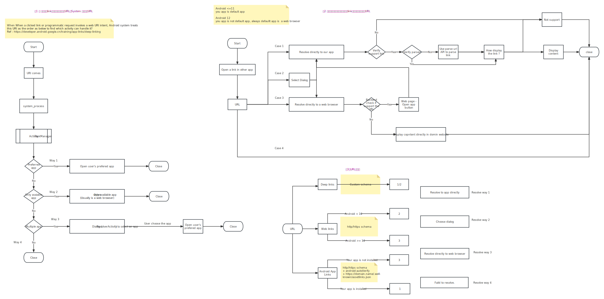

# Android Links

Example Code :  
[receive_app_links](https://github.com/YingVickyCao/android-about-demos/tree/master/receive_app_links)  
[other_app_having_app_links](https://github.com/YingVickyCao/android-about-demos/tree/master/other_app_having_app_links)  
[the wesite of domain](https://github.com/YingVickyCao/server/tree/master/http_server)

# 1 Deep links/Web links/Android App Links

Android have 3 different types of links: Deep links/Web links/Android App Links

<div align="left"> 
<div>



# 1 Deep links

测试用例：[Android.xls](../Android.xlsx) - App_links_deep_links

如何测试？例如：https://6c04-114-87-148-43.ngrok.io/recipe/  
方式 1: 从 other_app_having_app_links app 点击 link，查看是否跳转到 receive_app_links app  
方式 2：从 web browser 点击 link，查看是否跳转到 receive_app_links app  
方式 3：adb shell am 命令，查看是否跳转到 receive_app_links app （Recommended）

```
adb shell am start -a android.intent.action.VIEW -d "https://6c04-114-87-148-43.ngrok.io/recipe/"
```

# 2 Web links

略。Deep links 测试中已经包含。

<h1 id="android_app_links">3 Android App Links</h2>

Android 12 中，if Domain approved，点击 Link , Resolve to app directly。If not , Resolve directly to web browser.

Android App link how to associated with a particular domain?


略。Deep links 测试中已经包含。
优点：If url 匹配 intent-filter 和 assetlinks.json，若安装了 app，点击 url 直接跳转到 app。若没有安装，直接跳转到 host，不会出现 404 errors

## Way 1 : Digital Asset Links JSON file

Step 1 :Add intent-filter for Android App Links

Example :

```xml
 <activity
            android:name=".DisplayAndroidAppLinkActivity"
            android:exported="true">

            <intent-filter android:autoVerify="true">
                <action android:name="android.intent.action.VIEW" />

                <category android:name="android.intent.category.DEFAULT" />
                <category android:name="android.intent.category.BROWSABLE" />

                <data android:scheme="http" />
                <data android:scheme="https" />
                <!--                android:pathPrefix="/recipe"-->
                <data android:host="6c04-114-87-148-43.ngrok.io" />
            </intent-filter>
        </activity>
```

Step 2 :Create assetlinks.json

Example :

```
// package_name, sha256_cert_fingerprints differs in different app
[
  {
    "relation": [
      "delegate_permission/common.handle_all_urls"
    ],
    "target": {
      "namespace": "android_app",
      "package_name": "com.example.receive_app_links",
      "sha256_cert_fingerprints": [
        "64:FA:15:14:12:B3:C0:77:B2:78:14:B3:1D:4E:1D:C5:55:2F:00:34:49:EF:AC:90:4C:CE:6D:DE:72:A0:7C:24"
      ]
    }
  }
]
```

Step 3 : Expose assetlinks.json to https://domain.name/.well-known/assetlinks.json

Step 4 :0 Vefify https://domain.name/.well-known/assetlinks.json  
Example : http://6c04-114-87-148-43.ngrok.io/.well-known/assetlinks.json

How to start local server, see [http-server](../../../tools/http-server.md)?  
See assetlinks.json example in server : [assetlinks.json in http_server](https://github.com/YingVickyCao/server/tree/master/http_server)  
How to expose local server to external, see [ngrok](../../../tools/ngrok.md)

Step 4 : Vefify https://digitalassetlinks.googleapis.com/v1/statements:list?source.web.site=https://domain.name&relation=delegate_permission/common.handle_all_urls

```
Example : Connect VPN, then https://digitalassetlinks.googleapis.com/v1/statements:list?source.web.site=https://6c04-114-87-148-43.ngrok.io&relation=delegate_permission/common.handle_all_urls
{
  "statements": [
    {
      "source": {
        "web": {
          "site": "https://6c04-114-87-148-43.ngrok.io."
        }
      },
      "relation": "delegate_permission/common.handle_all_urls",
      "target": {
        "androidApp": {
          "packageName": "com.example.receive_app_links",
          "certificate": {
            "sha256Fingerprint": "64:FA:15:14:12:B3:C0:77:B2:78:14:B3:1D:4E:1D:C5:55:2F:00:34:49:EF:AC:90:4C:CE:6D:DE:72:A0:7C:24"
          }
        }
      }
    }
  ],
  "maxAge": "2856.466382943s",
  "debugString": "********************* ERRORS *********************\nNone!\n********************* INFO MESSAGES *********************\n* Info: The following statements were considered when processing the request:\n\n---\nSource: Web asset with site https://6c04-114-87-148-43.ngrok.io. (which is equivalent to 'https://6c04-114-87-148-43.ngrok.io')\nRelation: delegate_permission/common.handle_all_urls\nTarget: Android app asset with package name com.example.receive_app_links and certificate fingerprint 64:FA:15:14:12:B3:C0:77:B2:78:14:B3:1D:4E:1D:C5:55:2F:00:34:49:EF:AC:90:4C:CE:6D:DE:72:A0:7C:24\nWhere this statement came from:\n  Origin of the statement: Web asset with site https://6c04-114-87-148-43.ngrok.io. (which is equivalent to 'https://6c04-114-87-148-43.ngrok.io')\n  Include directives followed (in order):\n    \u003cNone\u003e\nMatches source query: Yes\nMatches relation query: Yes\nMatches target query: Yes\n\n--- End of statement list. ---\n\n\n"
}
```

Step 5 : Verify the android app link if can resolve directly to our app

**VPN conntected on Android 12 or greater, after installed our app, only first time opening the domain url will cause verify assetlinks.json**

```
adb shell am start -a android.intent.action.VIEW -d "https://6c04-114-87-148-43.ngrok.io/recipe/"

Query  the verification state of the domains
adb shell pm get-app-links --user cur PACKAGE_NAME
adb shell pm get-app-links cur PACKAGE_NAME
```

## Way 2 : ask the user to associate your app with that domain

Step 1 : Use DomainVerificationManager API.  
Step 2 : "Open by default Dialog":用户选择 open supported links in app by default，then Add link
Step 3 : Verify the android app link if can resolve directly to our app. 同 Way 1 - Step 5。

## 测试结论：

- Intent.URI_ANDROID_APP_SCHEME  
  Depressed : `scheme://host?querry#Intent;scheme;package;end `  
  （1）//前的 scheme 是 Intent 的 shema，不校验 Intent;后的 “scheme=;package=“  
  （2）整个 string 作为 data。  
  Recommend : `scheme://host?querry#Intent;;end`

- Intent.URI_INTENT_SCHEME vs Intent.URI_ANDROID_APP_SCHEME  
  Intent.URI_INTENT_SCHEME 因为有 package 信息更高效。  
  Intent.URI_INTENT_SCHEME 的 data 的 string 更准备，没有多余的信息。

- 根测试结果发现 中对 http 和 http schema link？  
  Android 11 ： Choose dialog 打开的.  
  Android 12 ： "Resolve directly to web browser"。因为 Android 12 中 app 默认不再作为 default app 。如果 缺少 https://host/.well-known/assetlinks.json，会直接跳转到 web browser.

- **approved domain**
  (1）只要 Domain has passed Android App Links verification，就会记录在系统中。更新 app，不会清除该记录。  
  (2）删除 app，然后重新安装 app，verified 信息将从系统记录中清除。

  ```
    $ adb shell pm get-app-links cur package
        com.example.receive_app_links:
          ID: 514b99af-1376-47ed-9120-c2bb3fd7ad45
          Signatures: [64:FA:15:14:12:B3:C0:77:B2:78:14:B3:1D:4E:1D:C5:55:2F:00:34:49:EF:AC:90:4C:CE:6D:DE:72:A0:7C:24]
          Domain verification state:                      => Way 1 : Digital Asset Links JSON file
            6c04-114-87-148-43.ngrok.io: verified         => 1024 : Error code of 1024 or greater。 通常是因为verify时系统需要google api 校验 JSON file,所以需要连接VPN
          User 0:
            Verification link handling allowed: true
            Selection state:
              Disabled:
                6c04-114-87-148-43.ngrok.io              => Way 2 : ask the user to associate your app with that domain

     // 删除app 后
     $ adb shell pm get-app-links --user cur com.example.receive_app_links
      com.example.receive_app_links:
        ID: cd29237f-d421-4c4b-8087-7e32f264030b
        Signatures: [64:FA:15:14:12:B3:C0:77:B2:78:14:B3:1D:4E:1D:C5:55:2F:00:34:49:EF:AC:90:4C:CE:6D:DE:72:A0:7C:24]
        Domain verification state:
          6c04-114-87-148-43.ngrok.io: none       => 删除后，再重新安装app，自动从系统记录中移除这个host的Android App Links verification
        User 0:
          Verification link handling allowed: true
          Selection state:
            Disabled:
              6c04-114-87-148-43.ngrok.io
  ```

# Ref：

- https://doordash.engineering/2022/01/25/your-deep-links-might-be-broken-web-intents-and-android-12/
- https://developers.google.cn/digital-asset-links/v1/getting-started
- https://developer.android.google.cn/training/app-links
  <br/>

- https://developer.android.google.cn/studio/command-line/adb#am
- https://developer.android.google.cn/reference/android/content/IntentFilter
- https://developer.android.google.cn/reference/android/content/Intent#URI_INTENT_SCHEME
- https://developer.android.google.cn/reference/android/content/Intent#URI_ANDROID_APP_SCHEME
- https://developer.android.google.cn/studio/write/app-link-indexing
- https://developer.aliyun.com/article/595078?spm=a2c6h.14164896.0.0.22123783ypZMKl
