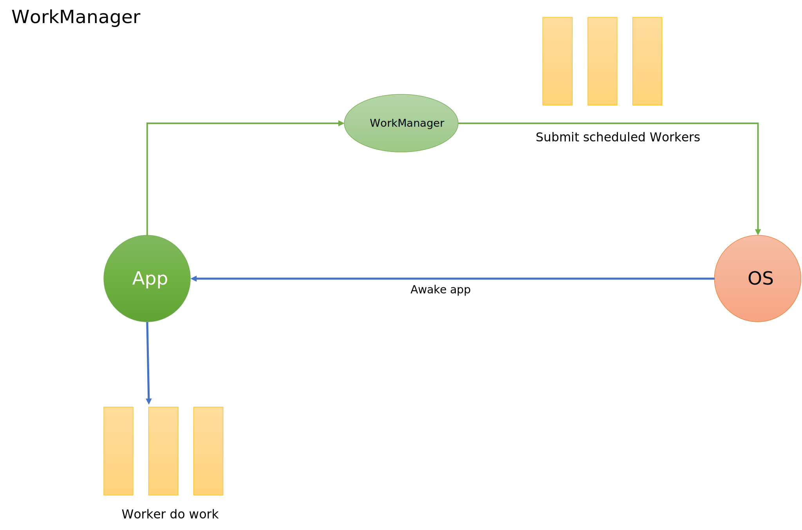
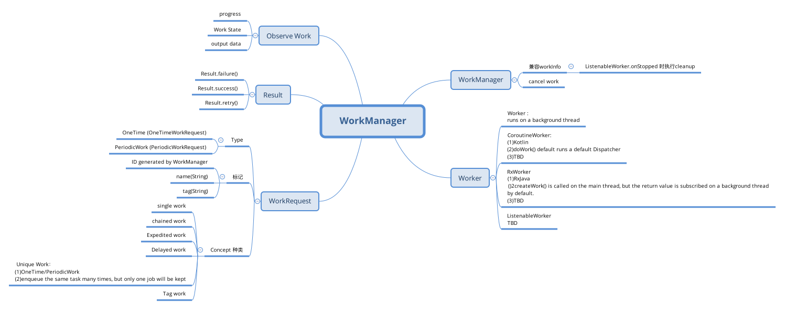

# WorkManager

[Code](https://github.com/yingvickycao/android-about-demos/blob/main/app/src/main/java/com/hades/example/android/_process_and_thread/workmanager/WorkManagerFragment.java) 

# 1 Schedule tasks with WorkManager
- App is running   
new Thread  

- App is  not running  
(1) Android >=6.0(API 23),JobScheduler   
(2) Android <6(API 23),compatible to  API 17       
Firebase JobDispatcher: If included dependency of your app   
AlarmManager    

# 2 What's the best way to do background work?

# Refs:
- [Schedule tasks with WorkManager](https://developer.android.google.cn/topic/libraries/architecture/workmanager/)
- [Guide to background processing](https://developer.android.google.cn/guide/background/)
- https://developer.android.google.cn/topic/libraries/architecture/workmanager/basics?hl=zh-cn
- https://developer.android.google.cn/courses/pathways/android-basics-compose-unit-7-pathway-1
- https://developer.android.google.cn/jetpack/androidx/releases/work
- https://developer.android.google.cn/guide/background/testing/persistent/debug?hl=en
- https://developer.android.google.cn/codelabs/android-adv-workmanager?hl=en#0
- https://developer.android.google.cn/guide/background/persistent/threading?hl=en
- https://developer.android.google.cn/courses/pathways/kotlin-fundamentals-nine?hl=zh_cn
