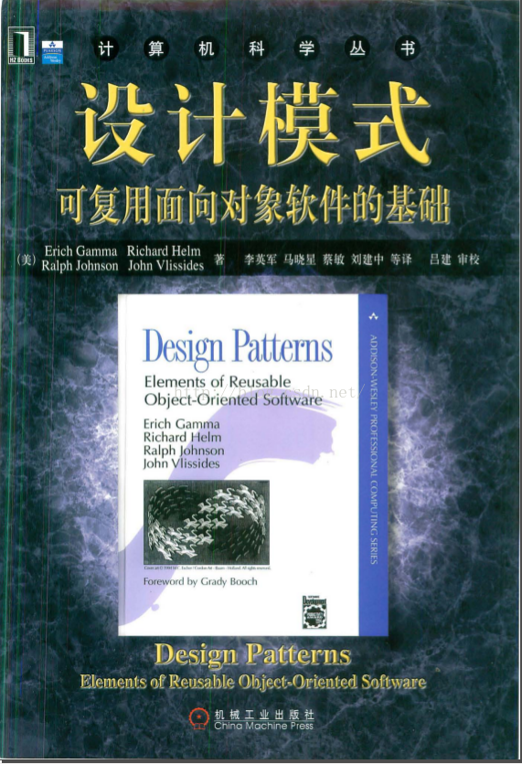

# 与设计模式相处 —— 真实世界中的模式

中文：Head First 设计模式  
作者：O'Reilly  

- 设计即生活。  
  思考：设计 即显化需求

- 设计模式适合任何 OO 语言
- 采用“类” UML 图，而非 UML 类图。
- 没有包含所有的设计模式  
  设计模式有很多：Gof 的基础模式、Sun 的 J2EE 模式、JSP 模式、架构模式、游戏设计模式  
  书中焦点是 Gof 的重要模式，Gof 的其他模式在附录中概略介绍
- 书中“组合（Composition）”，指 OO 一般概念中的组合 Composition，不是 UML 严格定义的 Composition
- Book Code  
  https://www.wickedlysmart.com/head-first-design-patterns/

- 设计模式是针对一些特定场景的、比较通用的解决方案。
- 学习设计模式  
  使用场景、方案（即用途：它解决了什么问题）、优点、缺点、与相似的模式之间的区别
- 使用设计模式  
  最好的方式：“把设计模式装进脑袋里，然后在设计和已有的应用中使用，寻找何处可以使用它们。”以往是代码复用，现在是经验复用。  
  优先考虑使用场景以及要解决的问题，其次考虑各种解决方案之间的优劣对比，最后——其实压根也不用去考虑——到底要使用模式 A 还是模式 B。

- 怎么学习设计模式？  
  最重要的设计模式？  
  何时使用设计模式?  
  为何使用该模式?  
  何时不该使用模式?  
  模式是基于哪些 OO 原则设计出来的？

# 1 知悉所有对“设计模式”定义的谬误

## 设计模式的定义

> 模式是在某情境（Context）下，针对某问题的某种解决方案

情境：应用某个模式的不断出现情况。  
e.g., 拥有一个对象的集合。

问题：想在某情境下达到的目标，或，某情境下的约束。  
e.g., 走访每个对象，而不需要理会该集合的实现。

解决方案：所追求的：一个通用的，用来解决约束、达到目的。  
e.g., 将迭代装进分离的类中。

帮助记忆的理解方式：

> “如果你发现自己处于某个情境下，面对着所欲达到的目标被一群约束影响着的问题，然而，你能够应用某设计，克服这些约束并达到该目标，将你领向某个解决方案。”

- Q ：遵循设计模式的定义，定义了一个问题、一个情境以及一个可行的解决方案，就是一个模式吗？  
  A ：即使有三部分，也不一定是一个模式。  
  因为设计模式是解决一个经常重复发生的设计问题。

- Q ：稍微改变某个模式的结构来符合设计？还是一定要严格遵守？  
  A : 可以改变模式。  
  模式只是指导方针，可以改变模式来符合需要。  
  真实世界中的许多实例，都不符合经典的设计模式。  
  当改变模式时，最好在文章中标注与经典的设计模式有哪些差异。目的是，其他开发人员能很快认出你用的模式，并了解两者的差异。

# 2 发现的新的模式并非只有专家能做到。你也有机会写下自己的模式

- Q ：可以创建自己的设计模式吗？  
  模式是被“发现的”，而不是被创建的。所以，任何人都可能发现某个设计模式，然后写出它的描述。

  应该想想为何你想发现自己的模式——`大多人都不是“编写”模式，只是使用模式。`  
  你可能在某一个特定的领域中工作，而你认为新的模式将大有帮助？  
  你找到一个解决方案，能够解决一个再三出现的问题？  
  你只是想要加入设计模式的社群贡献自己的力量？

- Q ：我有意愿，要如何开始？  
  知道的越多越好。`先研究已经被发现的这些模式，了解它们做了什么，并弄清楚它们和其他模式之间的关系`。  
  这些准备工作非常重要：熟悉模式是如何被打造出来的；避免做多余的工作。  
  完成这些准备工作后，将模式写在纸上，以便与其他开发人员沟通。

- Q ：如何知道我是否真的有一个模式？  
  除非其他人使用它并且发现它很有用，否则你并不算拥有一个模式。  
  一般来说，必须要通过`“三次规则”`，才算是一个合格的模式。即只有在真实世界中被应用三次以上，才算是一个模式。

## 如何设计一个模式？

Step 1 ： 在发掘新模式之前，必须先精通现有的模式。  
`许多模式看起来是全新的，其实只是现有模式的变种。`  
通过研究现有的模式，可以比较容易地识别模式，并学会将某一模式与其他模式联系起来。  
`PS`：  
读源代码，特别是 android API 是练习识别模式的最佳方法。既可以学会识别，又可以进一步熟悉 android 底层原理。

Step 2 : 花时间反思和评估  
经验（所遇到的问题、以及采取的解决方案）是模式想法的来源。所以，花时间反思过去的经验，并将它用在以后的新设计上面。  
当你真的找到了好像是新模式的东西时，常常都局限在很窄的适用中，而不能称得上是一个真正的模式。

Step 3 : 把想法写在纸上，方便让其他人能够理解  
将你的“准模式”写成一份文档，好让其他人能够阅读、理解，并采用它解决他们自己的问题，然后将使用的心得反馈给你。  
文档可直接采用四人组的模式。

Step 4 : 让其他人使用你的模式，然后持续改进  
通常不能一次就把模式搞定，应该把模式当成是随着时间不断进步的一项工程。让其他人评审你的模式，并尝试着使用它，然后将意见反馈给你。将这些反馈汇总到你的描述中，再重复上述的步骤。  
你的描述永远是不完美的，但到了某个时间点之后就会相当地稳固，足以让其他开发人员能够阅读并理解它。

Step 5 : 不要忘了三次规则。

# 3 避免在错误的时间点使用设计模式的尴尬

- 术语：`力`  
  设计模式定义中，问题包含了一个目标和一组约束。模式大师称之为“力”。  
  模式定义中力塑造并控制解决方案。  
  力有两个方向（目标和约束）。  
  只有当解决方案在两个方向中取得平衡时，这才算是设计模式。  
  需要力平衡才能创建一个模式的解决方案。

- Q : 如何使用类目？当遇到问题时，会翻阅它来寻找解决方案吗？  
  A :  
  Step 1 ， 熟悉所有的模式以及它们之间的关系。  
  Step 2 ，当需要一个模式时，大概知道是什么模式，然后参考动机和适用性的小结，确认想法没有错。  
  Step 3 ，浏览这个模式的结果，确保该模式不会给设计带来意外的影响。

# 4 有哪些设计模式类目，为何只需要买其中一本

- Q : 从哪里取得模式类目  
  A : 第一个，也是最重要 的一个设计类目是四人组的《设计模式：可复用面向对象软件的基础》。这个类目共 23 个基本模式。  
  还有很多将焦点放在不同领域的模式类目。e.g., 企业软件、并发系统、业务系统。

## Pattern Catolog (四人组模版)

| Catolog                    | Chinese  | DESC                                                           |
| -------------------------- | -------- | -------------------------------------------------------------- |
| Name                       | 名字     | 模式的名称。模式都有名字，该名字是一个共享词汇，方便谈论模式。 |
| Catolog                    | 类目     | 模式的分类或类目                                               |
| Intent                     | 意图     | 描述该模式的作用,可以看作是模式的定义 => 描述该模式是什么      |
| Motivation                 | 动机     | 给出了问题以及如何解决该问题的具体场景                         |
| Applicability              | 适用性   | 描述模式可以被应用在什么场合                                   |
| Structure                  | 结构     | 类图：提供了图示，显示出参与此模式的类之间的关系               |
| Participants               | 参与者   | 描述在此设计中所涉及到的类和对象在模式中的责任和角色           |
| Collaborations             | 协作     | 参与者如何在模式中合作                                         |
| Consequences               | 结果     | 描述采用此模式之后可能产生的效果：好与不好的                   |
| Implementation/Sample Code | 范例代码 | 提供代码的片段                                                 |
| Known Uses                 | 已只应用 | 描述已经在真实系统中发现的模式例子                             |
| Related Patterns           | 相关模式 | 描述了此模式和其他模式之间的关系                               |

Motivation + Applicability：描述何时何地地使用这个模式。  
PS：  
感觉这两者很像，不好区分。

每个模式的类目都包含了一组模式，也描述了模式之间关系上的细节。  
类目不止一个，有些类目是基础的设计模式，如四人组的。有些是领域特定模式，如 EJB 模式。  
模式和其他模式之间有何关联非常重要：差异性。

# 5 如何将模式分类

## 组织设计模式

随着模式的数量增多，有必要将它们分级分类：组织起来，以简化寻找模式的过程，并让同一组内的模式互相比较。
在大多数类目中，模式通常根据某种做法归为几类。

最流行的分类方式，是根据模式的目标分为三个不同的类目：创建型、行为型和结构型。

## 归类

### 按目的 （最常见）

#### 创建型

创建型模式涉及到将对象实例化，这类模式都提供一个方法，将客户从所需要实例化的对象中解耦。

| Creational       |
| ---------------- |
| Singleton        |
| Builder          |
| Abstract Factory |
| Factory method   |
| Prototype        |

#### 行为模式

涉及到类和对象如何交互以及分配指责。  
目的：对象之间的沟通与互连。

| Behavioral              |
| ----------------------- |
| Command                 |
| Observer                |
| State                   |
| Strategy                |
| Template Method         |
| Visitor                 |
| Mediator                |
| Interpreter             |
| Chain of Responsibility |
| Memento                 |

#### 结构型

把类或对象组合到更大的结构中。  
目的：用来描述类和对象如何被组合以建立新的结构或新的功能。

| Structural |
| ---------- |
| Decorator  |
| Facade     |
| Composite  |
| Proxy      |
| Adapter    |
| Bridge     |
| Flyweight  |

### 按模式所处理的是类或对象

#### 类

| 类              |
| --------------- |
| Template Method |
| Adapter         |
| Factory method  |
| Interpreter     |

#### 对象

| 对象                    |
| ----------------------- |
| Singleton               |
| Builder                 |
| Abstract Factory        |
| Prototype               |
| Command                 |
| Observer                |
| State                   |
| Strategy                |
| Visitor                 |
| Mediator                |
| Chain of Responsibility |
| Memento                 |
| Decorator               |
| Facade                  |
| Composite               |
| Proxy                   |
| Bridge                  |
| Flyweight               |

- Q : 为什么分类？  
   A : 通过比较让对模式有清晰的概念。  
   常常发现某个模式似乎不只适合一个类目：创建型、结构型和行为型，常常被搞得很晕。  
   怎么分类不重要，重要的是了解这些模式和它们之间的关系。  
   只要类目有帮助，就用它，反之反之就不用。

  分类能方便帮助在更抽象的层次上思考这些模式.  
  (1) 考模式组之间的关系,找出适合的模式，或缩小搜索范围  
   e.g., 石油越来越贵，应该买经济车，比较省油  
   e,g., 长途，跑车是最好的选择

  (2) 分类有助于同一个模式内模式之间的关系：比较  
  e.g., 一部省油的车子。

  (3) 类目帮助找出新的模式：  
  e.g., 想要一部跑车，具有法拉利的性能和 Miata 的价格。

- Q : 装饰者模式属于结构类目，而不是行为类目（增加行为）？  
  A ：焦点在于如何动态地组合以获取功能，而不是行为模式的目的

# 6 用模式思考

了解理论后，要有使用模式的经验和实践，才有意义。  
用模式思考：能够看着设计，体会在什么地方模式能自然适用，在什么地方则不能。

## 保持简单

当设计时，尽可能用最简单的方式解决问题。  
目标应该是简单，而不是“如何在这个问题中应用模式”。  
为了让设计简单且有弹性，有时候使用是最好的方法。

## 设计模式并非万灵丹

要使用模式，需要考虑模式对设计中其他部分造成的后果。

# 何时需要模式

何时使用模式？当设计时，确定在设计中可以利用某个模式解决某个问题，就使用这个模式。  
如果有更简单的解决方案，则在决定使用模式前，应该先考虑这个方案。

如何知道何时适用一个模式，需要经验和知识。  
当一个简单的解决方案无法满足需要时，应该考虑这个问题以及相关的约束，该力能帮助将问题对应到一个模式中。  
对模式有很深的认知，可能知道什么模式适合这样的情况。否则，花时间调查可能解决这个问题的模式：模式类目中的意图和应用部分特别有用。

## 重构的时间就是模式的时间

重构时通过改变代码来改进它的组织方式的过程。目的是改善其结构，而不是行为。  
重构时，重新检查设计来看是否能够利用模式来让它拥有更好的结构。

## 拿掉不需要的，不要害怕将一个设计模式从设计中删除。

何时应该删除这个模式？  
当系统变得非常复杂，而且不需要预留任何弹性的时候，就不要使用模式。  
即：当一个简单的解决方案比使用模式更恰当的时候。

## 如果现在不需要，就别做

设计模式威力很大，很容易在当前设计中看到模式的各种应用方式。开发人员天生热爱创建漂亮的架构以应对任何方向的改变。  
要抵制这种诱惑。基于实际需要去支持改变，而不是假想。否则，添加很多不需要的模式，只会将系统变得越来越复杂，可能永远不会需要它。

# 7 模式自然地出现

设计不是从模式开始。一开始总是遵守设计原则，建立最简单的代码来完成工作。在这个过程中，看到有需要模式的地方，就使用设计模式。  
“应用模式”不是开始设计时所该有的目标，应该是模式在设计过程中自然而然地出现。

使用模式要小心？  
模式可能带来复杂性，如果没有必要，不需要这样的复杂性。

何时引入设计模式？  
当设计中有一个问题需要解决的时候，或者确定未来的需要可能会改变时，可能采用模式。

学习管理软件的复杂度和变化，是一生的课题。  
本文中模式是一些基础模式，还有很多模式等着学习，包括一些应用在特定领域的模式，e.g.,并发系统（concurent system）、企业系统。学好这些基础模式，再去学习这些模式不会太难。

# 8 使用模式的心智

## 初学者的心智

“我使用越多模式，我的设计就越好。”  
“我要为 Hello World 找个模式”。

初学者到处使用模式，多了很多使用模式的实践经验。但慢慢就会认识到：  
所有的设计中都应该保持简单。只有当需要实践扩展时，才值得使用复杂性和模式。

## 中级人员的心智

“或许这里我需要一个单件模式”

开始能够分辨何时需要模式，何时不需要模式。  
虽然依然会企图把许多的模式套到不适当的地方，但他们开始察觉有些模式并不适合当前的情况，对其改编使其适应。

## 悟道者的心智

“在这里采用装饰者模式相当自然”  
能够看到模式何时能够自然融入。  
并不急于使用模式，而致力于最能解决问题的解决方案。  
会考虑对象的原则，以及它们之间的折衷。  
当对模式的需要自然出现时，能非常适宜地采用模式。  
看到相似模式之间的关系。  
不让这些模式知识过度影响设计的决策。

# 9 何时不使用设计模式？

如何理解：`过度使用设计模式可能导致代码被过度工程化。应该总是用最简单的解决方案完成工作，并在真正需要模式的地方才能使用它`?  
使用设计模式时，仍然会有缺点。  
模式常常增加一些额外的类和对象，这会增加设计的复杂度。  
设计也会在设计中加入更多层，这不但会增加复杂性，也会效率下降。  
有时使用模式会大材小用，使用更简单的解决方案就能解决相同的问题。应该使用较简单的解决方案。

# 10 共享词汇

模式是开发人员的共享词汇。

使用共享词汇？  
将设计变得跟好；  
更容易沟通：  
节省时间。

## 共享词汇的五种方式

1 在设计会议中  
在设计会议中，从设计原则和面向对象的原则的视角讨论设计，避免团队很快陷入实现堵塞细节，避免发生很多误解。

2 和其他开发人员  
帮助其他开发人员学习新模式，并建立一个社群。  
和别人分享所学会的东西是很有成就感的一件事。

3 在构架文档中  
当编写架构文档时，使用将会缩减文档的篇幅，让读者更清楚地了解设计。

4 在代码注释以及命名习惯上  
在编写代码时，应该在注释中清楚地标注所使用的模式。  
在选择类和方法的名称时，应该尽可能地显出隐 藏在下面的模式。  
这样可以让其他开发人员快速了解代码实现。

5 将志同道合的开发人员集合在一起  
分享知识。  
你可以自愿为他们讲一堂模式介绍课，或成立一个读书会。  
通过改进模式词汇，结交朋友，并影响周围开发人员

# 11 “四人组”

第一群将模式归类的功臣。

四人组发起了软件模式运动。随后有很多人也做出了重大的贡献：
ward cunningham,Kent Beck，Jim Coplen,Grady Booch, Bruce Anderson,....

# 12 模式资源

## 设计模式的经典书籍：

- `《Design Patterns: Elements of Reusable Object-Oriented Software》`  
  中文：《设计模式：可复用面向对象软件的基础》  
   经典但难懂。  
   作者是`四人组（Gang of Four，GoF）：Gamma, Johnson, Helm, Vlissides`。  
   

《Head First 设计模式》，可以看作是《Design Patterns》的注释版/ 白话版/漫画版/搞笑版，涵盖了 24 个设计模式。  
 特点：易懂、简单、有趣。  
 可以作为设计模式的入门。

## 模式的经典书籍

模式并非从软件开始，而是始于建筑和城镇的架构。  
克里斯托佛·亚历山大（Christopher Alexander）  
Alexander 是伯克利的建筑教授，发明了建筑模式（像房屋、城镇和城市）.

`《The Timeless Way of Building》（《建筑的永恒之道》）`  
`《A Pattern Language》`

通过阅读这两本书，了解设计模式的真正起源，体会参加创建“有生命的”建筑和具有弹性、可扩展性软件之间的对比。

## 周围人推荐的书籍

- 《设计模式之禅》  
  http://yuedu.baidu.com/ebook/d7260e63844769eae109ed60?fr=aladdin&key=

## 其他设计模式资源

### 网站

- The Portland Patterns Repository  
  http://wiki.c2.com/?WelcomeVisitors  
  run by Ward Cunningham  
  一个模式相关信息的 Wiki，任何人都可以加入。里面有许多模式和 OO 系统的问题在这里都有主题讨论。

- Hillside Group
  旨在促进通用的编程和设计实践，并提供模式的集中资源。该网站包含了许多模式的相关资料和信息， e.g., 文章、书籍、邮件列表和工具  
  http://hillside.net/

### 会议和研讨会

Hillside 网站有与模式相关的会议和研讨会的完整清单，可以和模式社群面地面接触。  
OOPSLA 是 ACM 举办的研讨会，主题是针对面向对象系统、语言和应用。

# 13 模式动物园

模式的概念可以被应用在许多不同的领域

## 架构模式

用来建立建筑、城镇和城市的架构，这也是模式开始的地方。  
栖息地：居住、观看、参观的建筑物  
e.g., 仿生态建筑

## 应用模式

建立系统级架构的模式。许多层的架构都属于这一类。  
栖息地：出现在三层架构、客户/服务器系统以及 Web 中。  
e.g., MVC

## 领域特定模式

关注特定领域的问题，例如：并发系统或实时系统。

## 业务流程模式

描述业务、顾客和数据之间的交互。  
此模式能够处理“如何有效决策并沟通决策”之类的问题。  
栖息地：出没在公司的会议室以及项目管理会议中。

## 组织模式

描述人类组织的结构以及实践。  
目前大多数努力聚焦于制造或支持软件的组织。  
栖息地：开发团队、顾客支持团队

## 用户界面设计模式

致力于解决设计交互软件时的问题 。  
栖息地：被发现在视频游戏设计者、GUI 构造者和制作者附近。

# 14 反模式

> 反模式:告诉我们如何采用一个不好的解决方案解决一个问题。
