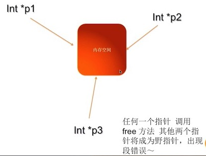
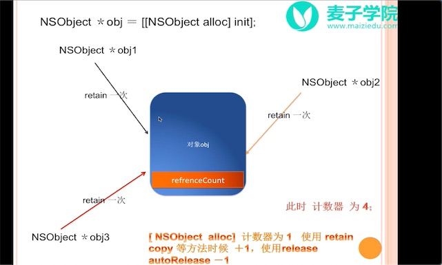
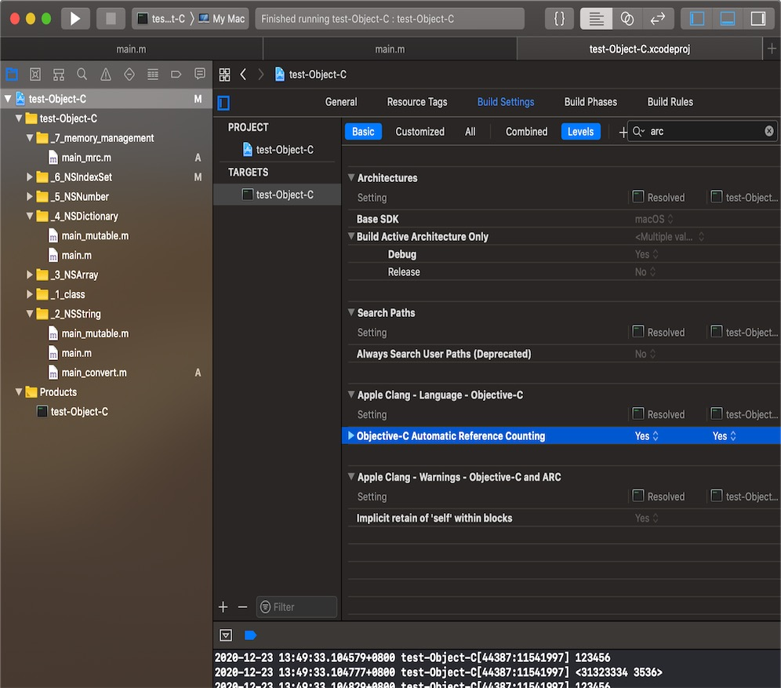

# 内存管理机制

分为 MAC 和 ARC。  
MAC: 手动回收内存
ARC: 自动回收内存。

## MRC

MRC(手工引用计数, Manual Reference Counting,简称 MRC )的机制
程序员给对象发送 release 消息，通知系统释放对象。

## ARC

ARC(自动引用计数，Automatic Reference Counting,简称 ARC)的机制。  
XCode 4.2 后，默认开启。  
程序员不用担心内存释放问题，并且可以依靠系统来释放内存。

# 浅拷贝 和深拷贝
# 1 MAC

- C 和 C++中的内存管理模式：  
  

- Object-C 中的内存管理模式：  
  

- 如何理解 MRC？  
  手动实现 MRC 机制下的 get 和 set 方法，理解内存管理机制。

- 如何开启 MRC 模式？ 改为 NO
  

- 内存管理 -> 黄金法则：  
  对一个 OC 中的对象进行 alloc、retain、copy、mutableCopy 的时候需要对该对象进行 release 或者 autoRelease 操作。

- 若一个类析构时，也应该对它的类变量手动析构。

```obj-c
- (void)dealloc{
    NSLog(@"Person3 is death.system invoke dealloc.");
    [_dog release];
    _dog = nil;
    [super dealloc];
}
```

# 2 ARC

```obj-c
// XCode < 5.0
int main(int argc, const char * argv[]){
    NSAutoreleasePool *pool = [[NSAutoreleasePool alloc]init];
    // code
    [pool release];
    pool = nil;

    NSAutoreleasePool *pool2 = [[NSAutoreleasePool alloc]init];
    // code
    [pool2 release];
    pool2 = nil;
}
```

- NSAutoreleasePool 可以有多个。

## @autoreleasepool

```obj-c
// XCode > 5.0
int main(int argc, const char * argv[]){
    @autoreleasepool {
      // code
    }
}
```

- 当对象没有用时，才会自动释放该对象。  
  因此。它的缺点是：释放比较晚，当短时间内申请大量对象时，内存可能爆掉。
- 自动释放在：在纯自动和纯手动之间。不如 Java 的内存自动释放。
