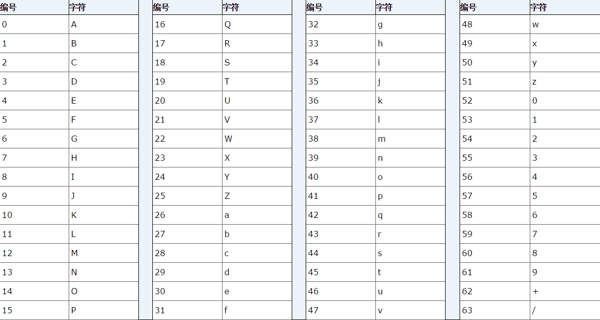
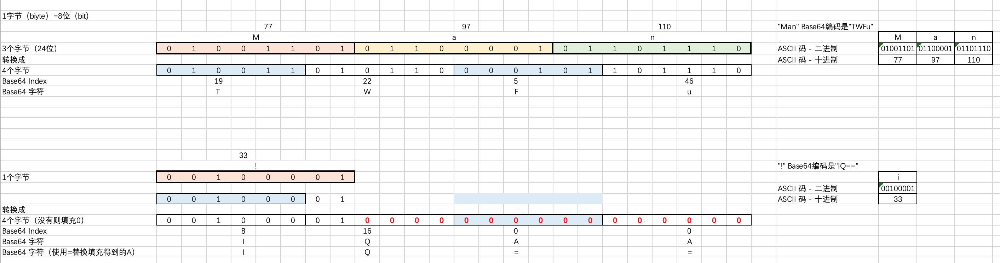

# Base 64

- Base 64 为什是可逆的？
  Base64 其实是一种简单的加密和解密算法。

- Base 64 为什么会出现？
  所有资源，包括图片、文本，在网络传输时，使用的是二进制格式。
  计算机中字节一共 256 个组合（ASCII），其中 128 ～ 255 的值是不可见字符。这些字符在不同部分传输时，包括路由、计算机、软件、网络协议等传输时（年代、新旧不同），代表的意义不同，做的处理也不同。
  为了解决不可见字符的错误处理，Base64 就出现了。  
  Base64 使用 64 个字符，经过 ASCII/UTF-8 编码后，不可见字符转换为可见字符，在大多数机器的行为是一样的。

## Base 64 使用形式

(1) 基本  
输入包含的字符为：`A-Za-z0-9+/`。共 64 个字符（26 + 26 + 10 + 1 + 1 = 64）。加上“=”（填充字符），一共是 65 个字符。  
编码不添加任何行标。

(12 URL  
输入包含的字符为：`A-Za-z0-9+_`。共 64 个字符（26 + 26 + 10 + 1 + 1 = 64）。加上“=”（填充字符），一共是 65 个字符。  
由于 URL 对反斜线“/”有特殊的意义，因此 URL 编码用用下划线`_`替换 L 对反斜线`/`。  
输出的内容对 URL 安全。

(3) MIME：  
输入包含的字符为：同(1)基本，再加上` \r`和`\n `，一共是 67 个字符。  
输出是对 MIME 友好的格式。  
输出每行不超过 76 字符，以'\r\n'分割行，最后一行没有'\r\n'。

- 编码器封装 FileOutputStream，以及解码器封装 FileInputStream 的，两者皆不需要缓冲 Buffer

## Base64 原理

- Base64 索引表
  Base64 索引表 是一个 有 64 对 Index 和字符的对应关系的表格。 =不在里面。  
  

- Base64 原理
  以 24 位(8 位 `*`3 组)为一个最小单位，拆分 6 位为一组，不够补 0. 最后把没有意义的 A 替换成=。

Ref：

[ASCII 码.md](/tools/ASCII码.md)

https://blog.csdn.net/chszs/article/details/17027649  
https://www.runoob.com/java/java8-base64.html  
https://blog.csdn.net/joeyon1985/article/details/53338221
