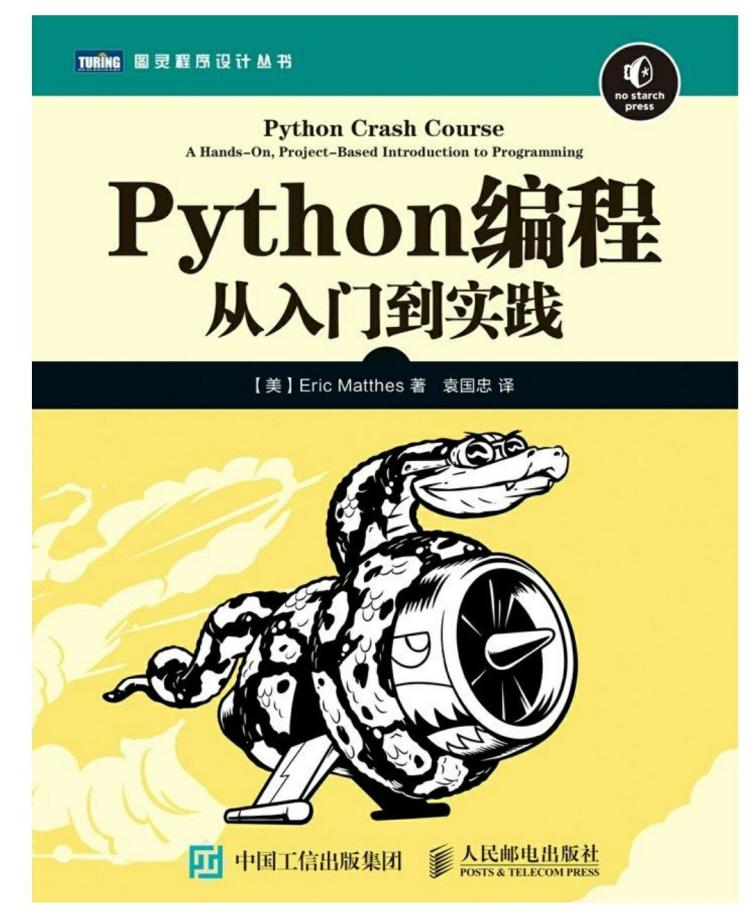

# Python Resources

# BOOK

- Python 编程 从入门到实践,[美] 埃里克·马瑟斯（Eric Matthes） 著，袁国忠 译  
  https://item.jd.com/11993134.html

  

# Online Courses

- https://www.bilibili.com/video/av50240377/?p=153
- https://www.python.org/
- PyCon 大会
