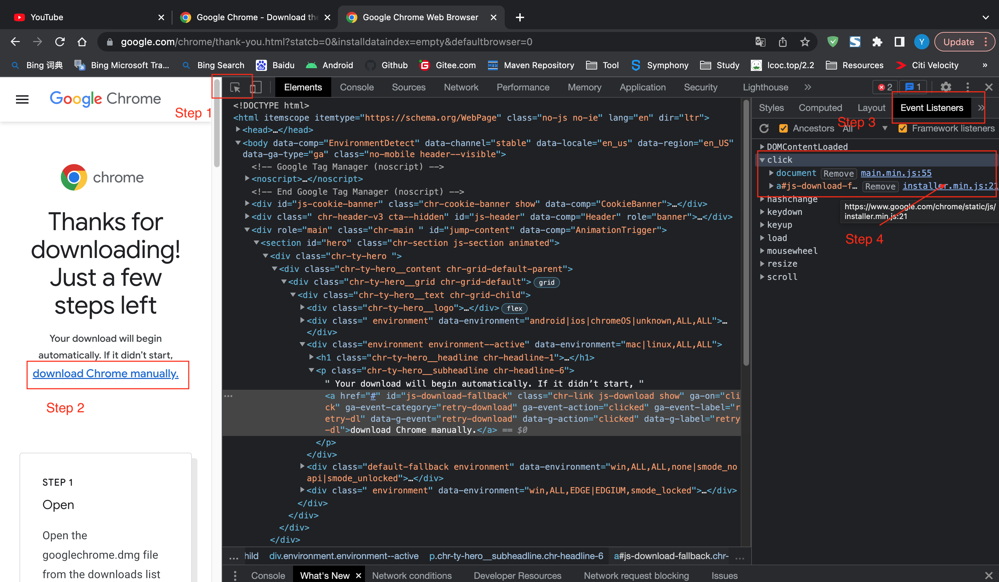
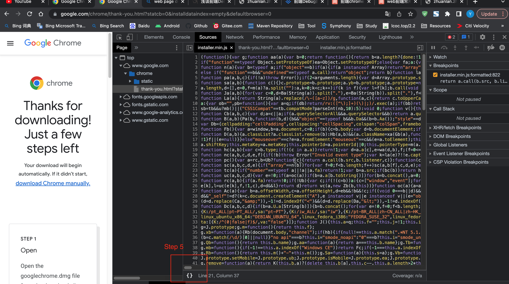
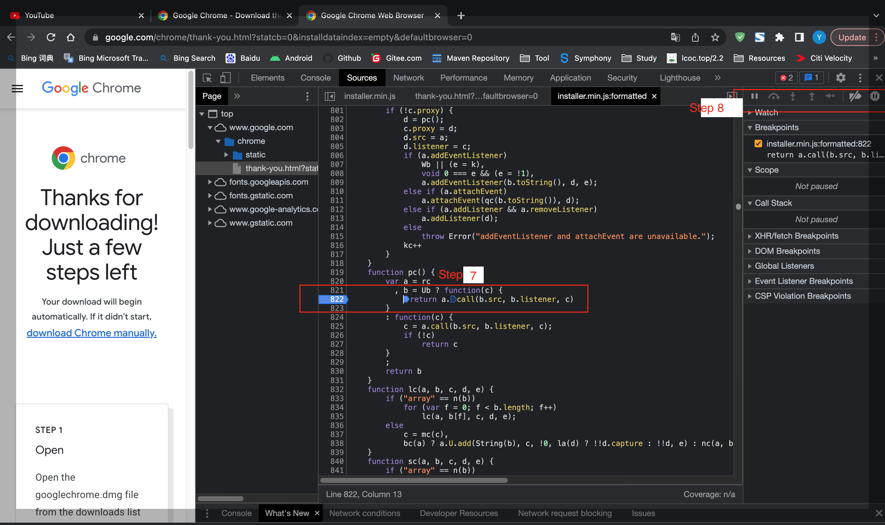
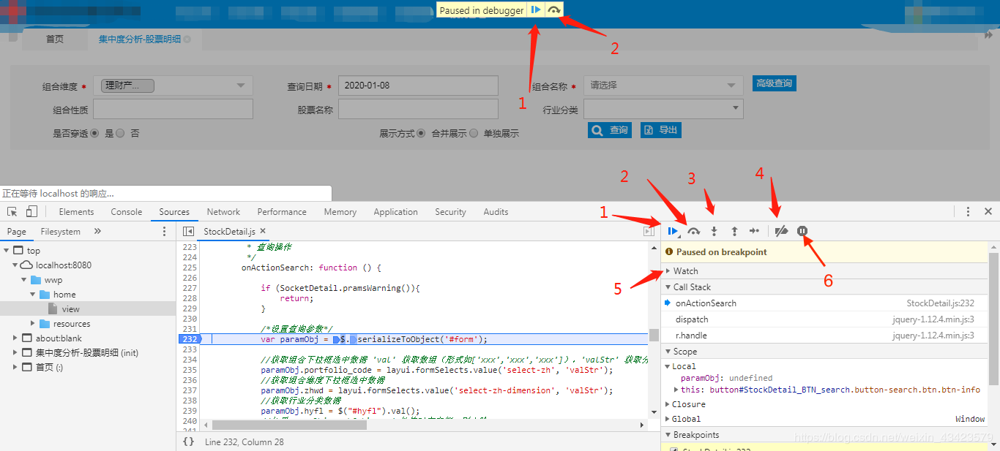

# How to debug Android App web page in Mac Chrome

# 1 Debug web page

- 1 Check android apk web request

    方法 1：Debug app web page in Chrome (Recommended)

    ```
    chrome://inspect
    ```

    方法 2： android studio logcat  
    方法 3：Charles

- 2 Debug html event / sources

    <div align="left"> 
    <div>

    然后 Command +Shift+P -> 打开命令 -> Open file "installer.min.js" -> 用 debugger 调试代码

    <div align="left"> 
    <div>

    <div align="left"> 
    <div>

- 3 如何 debugger ？
    <div align="left"> 
    <div>

    ```
    => 1、（三角形）debug 执行键/（等号）暂停脚本执行

    => 2、Step Over
    单步执行 注意：遇到子函数会进去继续单步执行

    => 3
    （下箭头）：step into 。单步执行，遇到子函数就进去继续单步执行。
    （上箭头）：step over。 单步执行，遇到子函数并不进去，将子函数执行完并将其作为一个单步。
    （右箭头）：step out。 直接跳出当前的函数，返回父级函数。

    => 4、禁用断点/启用断点

    => 5、Watch:debug时要看返回值或者参数，鼠标右键添点击“Add selected text to watches”

    => 6、暂停执行
    ```

- 4 Android debug app 允许 webview 调试

    ```java
    WebView.setWebContentsDebuggingEnabled(true);
    ```

- 5 【Chrome-> Network -> Response】 拷贝 json , 发现有些被转码(ASCII 码)？  
    Fix：【Chrome-> Network -> Preview】，json的跟节点，右键选“Copy object”


- 6 【Chrome-> 地址栏】 拷贝 url, 发现有些被转码(ASCII 码)？    
    Fix：Console中使用`copy(location.href)` 拷贝到粘贴板  

# FAQ

## 【FAQ-1】 ERROR: After Chrome app inspected app webview pages, says "HTTP/1.1 404 Not Found"

https://www.cnblogs.com/matric/p/10407783.html

**Try**：

| Mac Google Chrome | Android Google Chrome         | Android System WebView        | Result                        |
| ----------------- | ----------------------------- | ----------------------------- | ----------------------------- |
| 80.0.3987.87      | 76.0.3809.132                 | 76.0.3809.132                 | says "HTTP/1.1 404 Not Found" |
| 80.0.3987.87      | 76.0.3809.132 -> 80.0.3987.87 | 76.0.3809.132                 | says "HTTP/1.1 404 Not Found" |
| 80.0.3987.87      | 76.0.3809.132 -> 80.0.3987.87 | 76.0.3809.132 -> 80.0.3987.87 | OK                            |

Google Chrome
https://apkpure.com/google-chrome-fast-secure/com.android.chrome/versions?posts=1
Chrome_v80.0.3987.87_apkpure.com.apk

Android System WebView  
https://apkpure.com/android-system-webview/com.google.android.webview/versions  
Android_System_WebView_v80.0.3987.87_apkpure.com.apk  
[Chose Architecture](../../../tools/sdk/adb/adb.md#adb_abi) ? arm64-v8a = phone CPU Architecture

```
# Pixel 3

# chrome://inspect page
Pixel 3 #8CAX1LCYY
Chrome (76.0.3809.132)
WebView in uat (76.0.3809.132)  # Android System WebView(76.0.3809.132)

# says "HTTP/1.1 404 Not Found"
```

```
# Pixel 3

# chrome://inspect page
Pixel 3 #8CAX1LCYY
Chrome (76.0.3809.132)  -> Chrome (80.0.3987.87)
WebView in uat (76.0.3809.132)  # Android System WebView(76.0.3809.132)

# says "HTTP/1.1 404 Not Found"
```

```
# Pixel 3

# chrome://inspect page
Pixel 3 #8CAX1LCYY
Chrome (76.0.3809.132)  -> Chrome (80.0.3987.87)
WebView in uat (80.0.3987.87) # Android System WebView(80.0.3987.87)

# OK
```

```
# SM-T830

# chrome://inspect page
SM-T830 #CE021822D0CC3001017E
com.sec.android.app.sbrowser (67.0.3396.87) # 默认浏览器的内核不是Android System WebView
WebView in uat (72.0.3626.121) # Android System WebView(72.0.3626.121)

# says "HTTP/1.1 404 Not Found"
```

Reason：  
When inspect，使用的是 Android System WebView 与 Mac Google Chrome 进行通讯。
当 android < mac, 404.

Fix：  
Keep Mac Google Chrome 与 Android System WebView 版本一致。  
Method 1 ：Upgrade Android System WebView (Recommened)  
Method 2 ：Downgrade Mac Google Chrome
