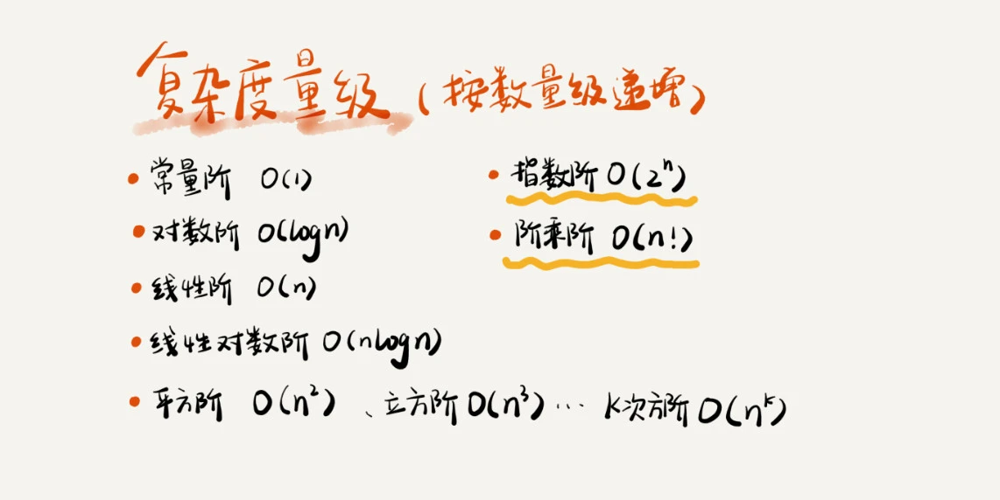
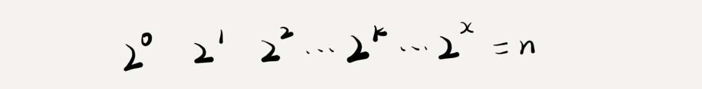
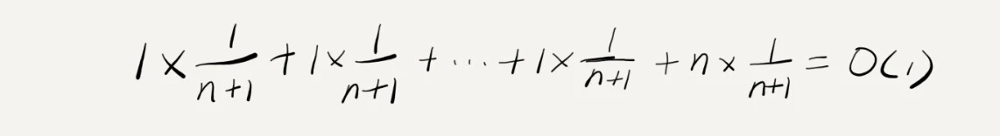
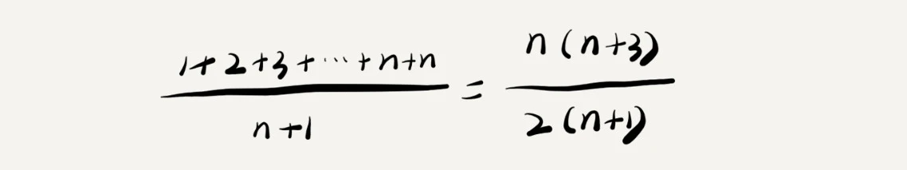
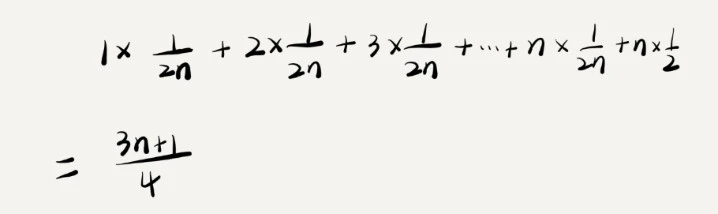
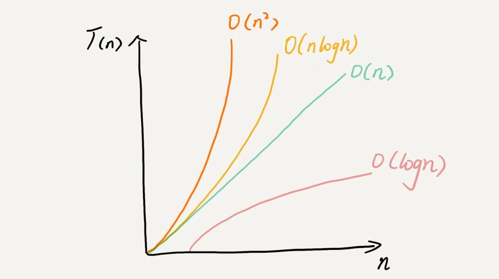

# 复杂度分析

# 1 数据结构和算法解决的是”快“和”省“

快：如何让代码运行更快  
省：如何让代码更节省存储空间。

执行效率是算法一个非常重要的考量指标。  
**用时间、空间复杂度分析来衡量编写的算法代码的执行效率。**

复杂度分析是整个算法学习的精髓，只要掌握了它，数据结构和算法的内容基本上就掌握了一半

# 2 为什么需要复杂度分析？

跑一遍代码，这种评估算法的方法，叫做“事后统计法”。也时也叫“性能基准测试”
局限性：
1）测试结果非常依赖测试环境。  
不同计算机有不同的硬件，测试结果差异较大。  
2）测试结果受数据规模的影响较大。  
比如排序，排序好，与完全不排序，不同的数据测试规模，执行时间差异比较大。  
3）不一定能及时去做测试。

因此，**需要一个不用具体的测试数据来测试，粗略地估计算法的执行效率的方法。** 就是时间、空间复杂度分析方法。
是一种粗略的分析模型，与性能基准测试并不冲突，重点在于编程时，要具有这种复杂度分析的思维。能快速识别出糟糕的算法设计。

# 3 时间复杂度分析

## 3.1 大 O 时间复杂度表示法

算法的执行效率，粗略地讲，就是算法代码执行的时间。

掌握 ： 大 O 时间复杂度的由来和表示方法

假设每行代码的时间是一样，为 unit_time。那么这段代码的总执行时间是多少？

```
规律：所有代码的执行时间 T(n) 与每行代码的执行次数 f(n)成正比。
把这个规律，总结成公式：T(n) = O (f(n) )
```

T(n) : 所有代码的执行时间。
f(n)：每行代码的执行次数总和。
n：表示数据规模的大小
O：表示代码执行时间 T(n)与 f(n)的表达式成正比。

[Example_1.java](https://github.com/YingVickyCao/Learn-Data-Structures-and-Algorithms/blob/main/src/main/java/com/hades/example/data_structures_and_algorithms/part1/Example_1.java)

[Example_2.java](https://github.com/YingVickyCao/Learn-Data-Structures-and-Algorithms/blob/main/src/main/java/com/hades/example/data_structures_and_algorithms/part1/Example_2.java)

说明：  
1)、第一个例子中的 T(n) = O(2n+2)，第二个例子中的 T(n) = O(2n^2+2n+3)。这就是大 O 时间复杂度表示法。**大 O 时间复杂度**实际上并不具体表示代码真正的执行时间，而是**表示代码执行时间随数据规模增长的变化趋势**，所以，也叫作**渐进时间复杂度（asymptotic time complexity）**，简称**时间复杂度**。
2）、当 n 很大时，你可以把它想象成 10000、100000。而公式中的低阶、常量、系数三部分并不左右增长趋势，所以都可以忽略。我们只需要记录一个**最大量级**就可以了，如果用大 O 表示法表示刚刚的那两段代码的时间复杂度，就可以记为：T(n) = O(n)； T(n) = O(n2)。

也就是说，时间复杂度的大 O 标记法中，可以省略掉系数、低阶、常量。

## 3.2 如何分析一段代码的时间复杂度？时间复杂度分析

### 1. 只关注循环执行次数最多的一段代码

[Example_2.java](https://github.com/YingVickyCao/Learn-Data-Structures-and-Algorithms/blob/main/src/main/java/com/hades/example/data_structures_and_algorithms/part1/Example_2.java)

在分析一个算法、一段代码的时间复杂度的时候，也只关注循环执行次数最多的那一段代码。

### 2. 加法法则：总复杂度等于量级最大的那段代码的复杂度 (Max)

[Example_3.java](https://github.com/YingVickyCao/Learn-Data-Structures-and-Algorithms/blob/main/src/main/java/com/hades/example/data_structures_and_algorithms/part1/Example_3.java)

### 3. 乘法法则：嵌套代码的复杂度等于嵌套内外代码复杂度的乘积

[Example_4.java](https://github.com/YingVickyCao/Learn-Data-Structures-and-Algorithms/blob/main/src/main/java/com/hades/example/data_structures_and_algorithms/part1/Example_4.java)

## 3.3 几种常见时间复杂度实例分析



掌握：
多项式 - 重点掌握几种常见的多项式时间复杂度。  
非多项式 - 非重点，知道就行

- 粗略分类：多项式量级 和 非多项式量级。其中非多项式量级只有两个：指数阶 O(2^n)和 阶乘阶 O(n!)
- 非多项式量级
  把时间复杂度为非多项式量级的算法问题叫作 NP（Non-Deterministic Polynomial，非确定多项式）问题。

  当数据规模 n 越来越大时，非多项式量级算法的执行时间会急剧增加，求解问题的执行时间会无限增长。所以，非多项式时间复杂度的算法其实是非常低效的算法。

### 1. O(1)

表示：常量级时间复杂度

[Example_5.java](https://github.com/YingVickyCao/Learn-Data-Structures-and-Algorithms/blob/main/src/main/java/com/hades/example/data_structures_and_algorithms/part1/Example_5.java)

### 2. O(logn)、O(nlogn)

- O(logn)

[Example_6.java - O(log<sub>2</sub>n), O(log<sub>3</sub>n)](https://github.com/YingVickyCao/Learn-Data-Structures-and-Algorithms/blob/main/src/main/java/com/hades/example/data_structures_and_algorithms/part1/Example_6.java)



- O(nlog<sub>n</sub>)
  如果一段代码的时间复杂度是 O(log<sub>n</sub>)，那么根据乘法法则，把循环执行 n 遍，时间复杂度就是 O(nlog<sub>n</sub>)。

[Example_7.java](https://github.com/YingVickyCao/Learn-Data-Structures-and-Algorithms/blob/main/src/main/java/com/hades/example/data_structures_and_algorithms/part1/Example_7.java)

### 3. O(m+n)、O(m `*` n)

[Example_8.java](https://github.com/YingVickyCao/Learn-Data-Structures-and-Algorithms/blob/main/src/main/java/com/hades/example/data_structures_and_algorithms/part1/Example_8.java)

[Example_9.java](https://github.com/YingVickyCao/Learn-Data-Structures-and-Algorithms/blob/main/src/main/java/com/hades/example/data_structures_and_algorithms/part1/Example_9.java)

为了表示代码在不同情况下的不同时间复杂度，引入三个概念：最好情况时间复杂度、最坏情况时间复杂度、平均情况时间复杂度

## 最好情况时间复杂度（best case time complexity）

定义：在最理想的情况下，这行这段代码的时间复杂度。
[Example_11.java](https://github.com/YingVickyCao/Learn-Data-Structures-and-Algorithms/blob/main/src/main/java/com/hades/example/data_structures_and_algorithms/part1/Example_11.java)

[Example_12.java](https://github.com/YingVickyCao/Learn-Data-Structures-and-Algorithms/blob/main/src/main/java/com/hades/example/data_structures_and_algorithms/part1/Example_12.java)

- [Example_13.java](https://github.com/YingVickyCao/Learn-Data-Structures-and-Algorithms/blob/main/src/main/java/com/hades/example/data_structures_and_algorithms/part1/Example_13.java)
  

## 最坏情况时间复杂度（worst case time complexity）

定义：在糟糕的情况下，这行这段代码的时间复杂度。
[Example_11.java](https://github.com/YingVickyCao/Learn-Data-Structures-and-Algorithms/blob/main/src/main/java/com/hades/example/data_structures_and_algorithms/part1/Example_11.java)

[Example_12.java](https://github.com/YingVickyCao/Learn-Data-Structures-and-Algorithms/blob/main/src/main/java/com/hades/example/data_structures_and_algorithms/part1/Example_12.java)

- [Example_13.java](https://github.com/YingVickyCao/Learn-Data-Structures-and-Algorithms/blob/main/src/main/java/com/hades/example/data_structures_and_algorithms/part1/Example_13.java)
  

## 平均情况时间复杂度（average case time complexity）

最好情况时间复杂度和最坏情况时间复杂度都是在极端情况下的复杂度，发生的概率并不大。  
为了更好的表示平均情况下的复杂度，引入另一个概念：平均情况时间复杂度，简称平均时间复杂度。
把每一种情况的下的复杂度累加起来，然后求平均值，得出平均时间复杂度。

- [Example_11.java](https://github.com/YingVickyCao/Learn-Data-Structures-and-Algorithms/blob/main/src/main/java/com/hades/example/data_structures_and_algorithms/part1/Example_11.java)

```
要查找的变量在数组中的位置，有n+1种情况：
---------------------------------------
在哪个位置  执行次数   时间复杂度
0          1        O(1)
1          2        O(2)
2          3        O(3)
...
n-1        n        O(n)
不包含x     n        O(n)
---------------------------------------
```

实际情况，要查找的变量在数组中位置的概率，并不是一样的。
要查找的变量 x，要么在数组中，要么不在，这两种情况对应的概率统计起来，很麻烦

方法 1 ：不考虑各种情况发生的概率。  
 假设要查找的变量在数组中位置的概率，都是一样的。也是比较简单的估算方式。

平均时间复杂度？

省略推导过程，窍门：1 + 2 + 3 + n + n = n\*(n+1)/2
时间复杂度的大 O 标记法中，省略掉系数、低阶、常量，公式简化后，得到的时间复杂度为 O(n)

方法 1，推到过程有点问题，因为它没有考虑各种情况发生的概率考虑进去。

方法 2 ：考虑各种情况发生的概率。也就是 引入了对应的概率统计。  
 为了理解容易，假设在数组中与不在数组中的概率都为 1/2。  
 另外，要查找的数据出现在 0 ～ n-1 这 n 个位置的概率也是一样的，为 1/n。  
 所以，根据概率乘法法则，要查找的数据出现在 0 ～ n-1 中任意位置的概率就是 1/(2n)。

平均时间复杂度?  
  
Note : 这这个值，也就是概率论中的加权平均值，也叫做期望值，得出的数值 就是平均值了，因此，不用再除以（n+1）了。

引入概率后，发现：大 O 表示法来表示，去掉系数和常量，最后，加权平均时间复杂度仍然是 O(n)。

- [Example_12.java](https://github.com/YingVickyCao/Learn-Data-Structures-and-Algorithms/blob/main/src/main/java/com/hades/example/data_structures_and_algorithms/part1/Example_12.java)
  根据概率论，  
  count ！= array.length 时，一共有 n 种情况，每一种情况的时间复杂度是 O(1).  
  count ！= array.length 时，时间复杂度是 O(n).  
  那么，一共有 n+1 种情况，每一种情况的概率都是 1/(n+1).  
  根据加权平均的计算方法，求出平均时间复杂度为：2(n+1)/(n+1) = 2 => O(1)
  

- [Example_13.java](https://github.com/YingVickyCao/Learn-Data-Structures-and-Algorithms/blob/main/src/main/java/com/hades/example/data_structures_and_algorithms/part1/Example_13.java)
  
  平均情况时间复杂度：2n/(n+1) => o(1)

- 方法 2 中值，是概率论中的加权平均值，也叫作期望值，所以**平均时间复杂度的全称应该叫加权平均时间复杂度或者期望时间复杂度**。

- 平均情况时间复杂度，因为涉及概率论的知识，分析会比较复杂。实际上，大多数情况下，并不需要区分最好、最坏、平均情况时间复杂度。很多时候，我们使用一个复杂度就可以满足需求了。**只有同一块代码在不同的情况下，时间复杂度有量级的差距，我们才会使用这三种复杂度表示法来区分。也就是说，平均复杂度只有在某些特殊情况下才会用到。**

## 均摊时间复杂度（amortized time complexity）

[Example_12.java](https://github.com/YingVickyCao/Learn-Data-Structures-and-Algorithms/blob/main/src/main/java/com/hades/example/data_structures_and_algorithms/part1/Example_12.java)

分析方法：**摊还分析法**
count == array.length 时，时间复杂度是 O(n). 把这次操作均摊到 index = 0~n-1 操作上，每个 index 摊得了 1 次。
那么，加上 count ！= array.length 时，每次执行 1 次。
最后，每个 index 共 2 次。
那么，均摊下来，这一组连续的操作的均摊时间复杂度是 O(1)。

均摊时间复杂度和摊还分析应用场景比较特殊，所以我们并不会经常用到。

简单总结一下它们的应用场景。对一个数据结构进行一组连续操作中，大部分情况下时间复杂度都很低，只有个别情况下时间复杂度比较高，而且这些操作之间存在前后连贯的时序关系，这个时候，我们就可以将这一组操作放在一块儿分析，看是否能将较高时间复杂度那次操作的耗时，平摊到其他那些时间复杂度比较低的操作上。而且，在能够应用均摊时间复杂度分析的场合，一般均摊时间复杂度就等于最好情况时间复杂度。

一般认为，**均摊时间复杂度就是一种特殊的平均时间复杂度**，我们没必要花太多精力去区分它们。最应该掌握的是它的分析方法，摊还分析。至于分析出来的结果是叫平均还是叫均摊，这只是个说法，并不重要。

总结：
**同一段代码，在不同输入的情况下，复杂度量级有可能是不同的**，因此，引入了复杂度概念：最好情况时间复杂度、最坏情况时间复杂度、平均情况时间复杂度、均摊时间复杂度。  
一般平均、均摊说一个就好了。

[Example_13.java](https://github.com/YingVickyCao/Learn-Data-Structures-and-Algorithms/blob/main/src/main/java/com/hades/example/data_structures_and_algorithms/part1/Example_13.java)

# 4 空间复杂度分析

**空间复杂度**全称就是**渐进空间复杂度（asymptotic space complexity）**，表示**算法的存储空间与数据规模之间的增长关系。**

## O(n)

[Example_10.java](https://github.com/YingVickyCao/Learn-Data-Structures-and-Algorithms/blob/main/src/main/java/com/hades/example/data_structures_and_algorithms/part1/Example_10.java)

## 掌握什么？

常见的空间复杂度是 O(1)、O(n)、O(n2)。  
像 O(log n)、 O(n log n) 平时都用不到。

空间复杂度分析比时间复杂度分析要简单得多。掌握这些内容已经足够了。

# 5 内容小结

- **复杂度**也叫**渐进复杂度**，包括时间复杂度和空间复杂度，用来分析算法执行效率与数据规模之间的增长关系，可以粗略地表示，**越高阶复杂度的算法，执行效率越低。**

- 常见的复杂度并不多，从低阶到高阶有：O(1)、O(logn)、O(n)、O(nlogn)、O(n<sup>2</sup>)。
  几乎所有的数据结构和算法的复杂度都跑不出这几个。



- 复杂度分析并不难，关键在于多练。

- 思考：项目之前都会进行性能测试。那么，再做代码的时间复杂度、空间复杂度分析，是不是多余的？
  有必要。  
  性能测试，提供一种具体的数据分析，也是一个实验结果。  
  时间复杂度、空间复杂度，提供分析内因的方法因以及解释原因，也培养 coding 注意执行效率的思想。
