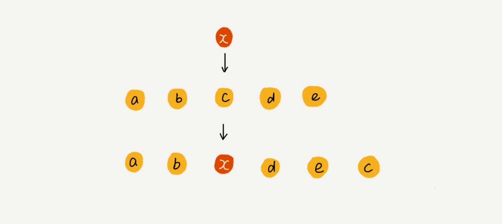

# 数组

# 1、什么是数组？

数组是一种一种线性表数据结构。它用一组连续的内存空间来存储一组相同类型的数据。

理解数组，也就是数组的特点：

（1）数组是一种线性表。  
（2）数组有连续的内存空间和相同类型的数据。  
（3）因为（1）（2）的限制，它支持“随机访问”。

```
随机访问的缺点：
在数组中删除/插入一个数据，为了保证连续性，要做数据搬移。
```

# 2、什么是随机访问（Random Access）

Random Access，任意访问。即随意访问数据结构中的任意一个节点。  
例子：数组可以随机访问。假如一个数组有 10 个节点，可以任意访问 index=0 到的 index=9 的人任意节点。要访问第 5 个节点，array[4]即可。  
例子：链表不能随机访问。假如一个链表有 10 个节点，要访问第 5 个节点，只能从表头或表尾遍历每一个节点，

## 数组如何实现根据下标来随机访问数组的元素？

1 字节=8 位。  
一个长度为 10 的 int 数组，假如一个 int 的占 4 个字节，那么计算机给这个数组分配了一块连续的内存地址 000 到 1039（4 \* 10 = 40 个字节）.  
那么，1000 = a[0] 的地址 = 数组的首地址 = 该数组的内存块的首地址 。  
计算机给每个内存单元了一个地址，计算机通过地址来访问内存中的数据。当计算机随机访问数组中一个元素时，它通过寻址公式来计算该元素存储的内存地址。

```
// For example : int[] in java,  base_address : 100, data_type_size = 4
a[i]_address = base_address + i * data_type_size
```


# 3、线性表和非线性表

按照数据排成的结构，数据的结构有线性表和非线性表。

## 什么是线性表（Linear List）？

线性表是数据排成的像一条线一样的结构。  
每个线性表上的数据最多有前和后两个方向。  
线性表的常见例子：数组、栈、队列、链表  


## 非线性表

与线性表的概念相对立。  
非线性表的例子：堆、树、图。

为什么叫非线性？  
因为在非线性表中，数据之间并不是简单的前后关系。  


# 4、大部分编程语言中，数组是从 0 开始。为什么？ // TODO

# 5、数组操作

## 数组 - 低效的“插入”

数组的长度为 n， 插入第 k 个位置，需要把 k-n 往后顺序挪位。

时间复杂度：(n+n-1+...+2+1)/n=O(n)  
最好情况时间复杂度：O(1)。末尾插入，target_index = n  
最坏情况时间复杂度：O(n)。开头插入，target_index = 0  
平均情况时间复杂度：(1+2+...n)/n=O(n)。因为每个位置插入元素的概率是一样的。

如何优化插入操作？  
为了避免大规模大数据搬移，将第 k 的数据搬移到数组元素的最后，把新元素直接插入第 k 位置。  
例子：数组 a[10]中存储了如下 5 个元素：a，b，c，d，e。要求将元素 x 插入到第 3 个位置？将 c 放入 a[5], 然后将 a[2]=x。  
优点：在特定场景下，在第 k 个位置插入一个元素的时间复杂度降低为 O(1)  
缺点：有副作用，x 之后的顺序变了。



## 数组 - 低效的“删除”

## 数组 - 排序

选择排序
冒泡排序

## 数组 - 查找

二分法查找算法

数组（Array）

# 数组与链表的区别？

链表适合插入、删除，时间复杂度为 O(1)。  
数组支持随机访问，根据下标随机访问的时间复杂度是 O(1)。
