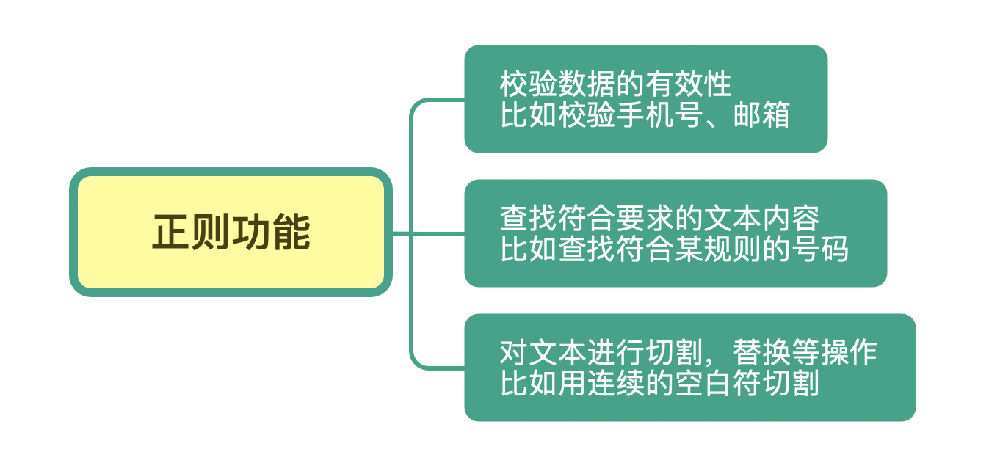
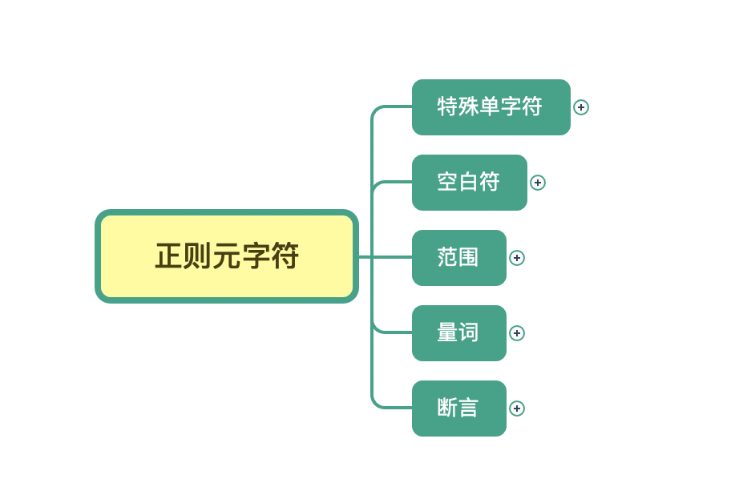
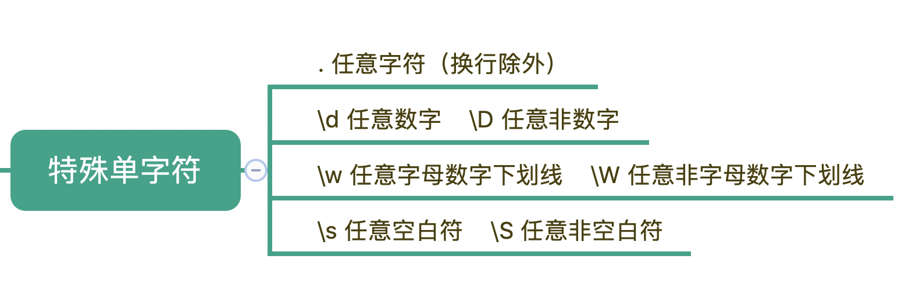
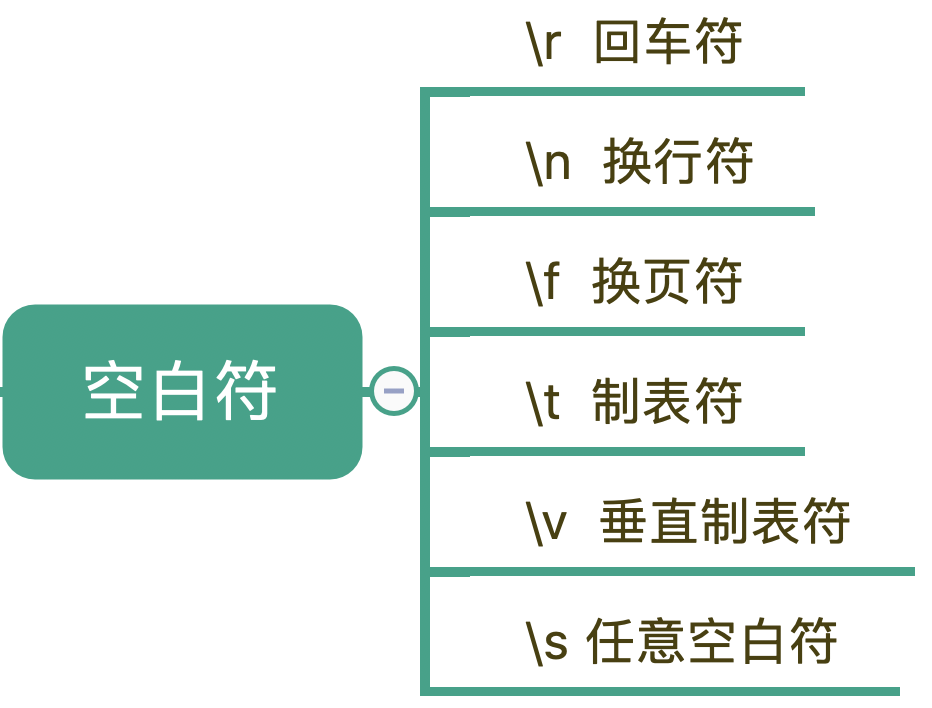

# 正则表达式

# 准备工作

1 如何测试正则代码？
测试正则可以用高级语言，Java/Python/JS 等。  
测试正则也可以在常见的编译器中测试，如 Sublime Text 3 等。  
For me, example code is using Python.

2 Python IDE 选择：
（1）IDEA 需要安装插件："Python"
https://blog.csdn.net/qq_52674444/article/details/125611085
（2）IDEA CE 需要安装 Python 插件："Python Community Edition"
（3）Pycharm
For me, Python IDE is PyCharm CE

3 安装插件 "Live code for Python"，可以实时预览结果。

# 1 为什么学习正则？

解决下面的问题：
1）、学过正则，但是太复杂了，记不住
2）、写的正则不管用，也不好调整
3）、从网上找的正则和需要的不一致，不知道怎么改，或者改了之后，不能适应所有的 case
4）、正则的性能

工作中不太正则，为什么还需要学习呢？
**不是工作中用不到，而是当你不熟悉一个技能的时候，遇到问题时根本不会考虑它。**

# 2 正则是什么，能做什么？

## 正则的概念

正则，全称是正则表达式，Regular Expression，简称 RE。  
**正则,其实是一种描述文本内容组成规律的表示方式。**

Example：
在编程语言中，正则用来简化文本处理的逻辑。  
在 Linux 命令中，它也可以帮助我们轻松地查找或编辑文件的内容，甚至实现整个文件夹中所有文件的内容替换，比如 **grep、egrep、sed、awk、vim** 等。  
另外，在各种文本编辑器中，比如 VS Code 等，在查找或替换的时候也会使用到它。总之，正则是无处不在的。

**正则是一个非常强大的文本处理工具。**  
=> 校验/筛选/查找/替换/删除/软件中 Replace 操作

# 3 学习正则，我们到底要学什么？

1、 正则的基本知识  
 正则的元符号、正则的模式和分组

[Example_1.py - 从文本中找出连续出现的重复单词](https://github.com/YingVickyCao/Learn-Regular-Expression/blob/main/Example_1.py)

2、在常见的编辑器中使用正则的方法

3、正则中进阶的内容  
正则中的断言（包括单词边界、行开始和结束、环视）  
三种主要流派的区别以及对应的软件实现。  
正则的工作机制和常见的优化方式等。  
不同语言使用时有差异.

=> 概念、功能、记忆方法、实际开发中的使用、概念模型，不同语言使用时有差异。

# 4 怎么学习和使用正则？

- 什么叫掌握方法呢？
  摆脱了字符的限制，深入到概念思维的层面。
   

- 怎样才算“入门”？
  通过学习掌握方法，后来无论用正则表达式解决什么问题，能自觉遵循下面的流程去走，甚至能达到不需要这个流程，也能做到解决问题。
   

  第⼀步，做分解。  
  拿到一个问题后，先思考：这个问题可以分为几个子问题？每个子问题是否独立？  
  例如，匹配电子邮件。从文本结构来看，可以分为“username + @ + domain name”这三个独立的部分。
  怎么画呢？可以先画出逻辑结构图。通过这个过程来厘清思路。

      
   第⼆步，分析各个子问题。

  某个位置上可能有多个字符？ 用字符组。  
   某个位置上可能有多个字符串？用多选结构。  
   出现的次数不确定？那就用量词。  
   对出现的位置有要求？那就用锚点锁定位置……

  某种程度上，这就像武术里的见招拆招，每个问题都有对应的解法，只要熟练掌握了，知道什么时候用字符组，什么时候用多选结构，什么时候用量词，什么时候用锚点，就很容易搭建起完整的概念模型。  
    

  第三步，套皮。  
   正则表达式的典型标志，比如方括号、星号、花括号。这些典型标志无非只是一些符号而已，真正重要的是字符组、多选结构、量词等这些概念。一旦概念模型清楚了，写出正则表达式就非常简单了。  
   查阅语法手册，把之前得到的概念模型按照对应语言或工具的约定写下来而已。  
   各种语言或工具对正则的支持大同小异，但是有细微差别。使用时注意差异一下，就可以。  
    

  第四步，调试。  
   如何调试？复杂的表达式不能一次性写对。拆分正则，看这一部分到底是正则表达式中的哪一部分，对应匹配文本中那一部分。
   

  学会正则之后，要保持克制。虽然正则的功能很强大，处理速度很快，但是并不可读。如果其他的更简单的方法，那么就用更简单的方法，不要选正则。
   

  => 先分析字符串结构 -> 选符号

- **如何“克制”？**
  **第一、能用普通字符串处理的，就用普通字符串处理。**
  例子：在大段文字中查询所有的 today 或 tomorrow  
  用简单的字符串查找，直接查两遍，就能搞定。
   

  **第二、能写注释的正则表达式，一定要写注释。**
  正则的语法不够直观。为了方便维护和阅读，添加注释。那么，复杂的正则的结构也能一目了然。
   

  **第三、能用多个简单正则表达式解决的，不要用一个复杂的正则表达式。**  
   例子：输入条件的验证。常见的密码要求“必须包含数字、小写字母、大写字母、特殊符号中的至少两种，且长度在 8 到 16 之间”。  
   一个复杂的正则表达式简直是噩梦。  
   用多个简单的正则同样能解决问题，虽然看起来繁琐，但是可维护性更强。

# 元符号

\d 和 {11}，在正则中有一个专门的名称——**元字符（Metacharacter)**  
元字符就是指那些在正则表达式中具有特殊意义的专用字符。  
元字符是构成正则表达式的基本元件。  
正则就是由一系列的元字符组成的。

分类元字符后，更好理解。

Example 1: 匹配“Hanmeimei is a girl”中的 H 之后的 a
https://regex101.com/r/KVJeDF/1

Example 2: 查找文本中的所有数字
https://regex101.com/r/S2TqDg/2

Example 3： 单个的数字出现了几次
https://regex101.com/r/CQLCfD/1

## Type 1. 特殊单字符

d 是 digit 数字
w 是 word 单词
s 是 space 空白

Example 4： 测试元字符 \d  
常见数字，字母，部分标点符号作为文本，用 \d 去查找数字。只能匹配 0 ～ 9 数字  
https://regex101.com/r/mN6Ldw/1

Example 5： 测试元字符 \w
https://regex101.com/r/iSK1EO/1

Example 6： 测试元字符 \D
https://regex101.com/r/dsU14l/1

Example 6： 测试元字符 \W
https://regex101.com/r/dZn5E8/1

Example 7： 测试元字符 \S
https://regex101.com/r/8EpmzT/1

## Type 2. 空白符

- 空白符有哪些？空格、换行、Tab 制表符\t

- 换行符，表示文本要换行，另起一行。
  换行符的在不同系统表示不同。
  CR 回车：\r
  LF 换行：\n

| OS                  | 遵循约定 | 换行符号 |
| ------------------- | -------- | -------- |
| Windows             | CR + LF  | \r\n     |
| Unix/Linux/macOS    | LF       | \n       |
| classic Mac OS(Old) | CR       | \r       |

https://lruihao.cn/posts/newline/

对于空白符号，平时使用正则，大部分用的是\s 就能满足要求。\s 能匹配上各种空白符号，也可以匹配上空格。
换行有专门的表示方式.
在正则中，**空格**就是用普通的字符英文的空格来表示。

Example 8：测试\s
https://regex101.com/r/hGa2X6/1

## Type 3. 量词

什么时候用量词？匹配多个单词。比如：重复 N 次/至少出现 1 次/最多出现三次。

Example 9： 测试+。 下面单词中 查询 r 出现 1 次或多次。`r+`
https://regex101.com/r/Scs7nW/1

Example 10：测试+。 在三行文本中列出数字出现 3 以及以上的地方。`\d+`
https://regex101.com/r/FXdxz8/1

Example 11：测试{m,n}。 在三行文本中列出数字出现 5 到 7 次的地方。`\d{5,7}`
https://regex101.com/r/y2ihwf/1

## Type 4. 范围

# Ref

正则网站或软件

1. https://regex101.com/ （老师用的）
2. https://tool.oschina.net/regex/
3. http://tool.chinaz.com/regex/
4. https://www.w3cschool.cn/tools/index?name=re
5. https://c.runoob.com/front-end/854
6. http://tools.haokh.net/Regex
7. Windows 上推荐：RegexBuddy
8. Mac 上推荐：Expressions

备注：1 中支持账号功能，可以保存后进行分享。2~6 都包含大量常用的正则示例。7&8 都需要付费。

## 书籍

《精通正则表达式》  
《正则指引》
